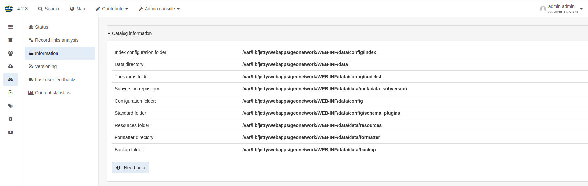

# Настройка директории данных {#customizing-data-directory}

Директория данных — это место в файловой системе, где каталог хранит большую часть своих пользовательских настроек и загружаемых файлов. Эта конфигурация определяет такие параметры, как:

-   Какой тезаурус использует GeoNetwork?
-   Какая схема подключена в GeoNetwork?

Директория данных также содержит ряд вспомогательных файлов, используемых каталогом для различных целей:

-   конфигурация индекса
-   логотипы
-   загруженные документы, прикрепленные к записям метаданных
-   миниатюры

Рекомендуется определять внешнюю директорию данных при переходе к эксплуатации (production), чтобы упростить будущие обновления. Директория данных позволяет WAR-файлу работать в режиме «только для чтения» в случае необходимости.

## Создание новой директории данных

Директорию данных необходимо создать перед запуском каталога. Она должна быть доступна для чтения и записи пользователю, запускающему каталог.

Если директория данных является пустой папкой, каталог инициализирует структуру директории по умолчанию, используя `INSTALL_DIR/web/geonetwork/WEB-INF/data`.

Если директория данных не задана, при запуске приложения в логе отображается следующее сообщение:

``` shell
2015-12-16 07:59:17,108 WARN  [geonetwork.data.directory] -     - Data directory properties is not set. Use geonetwork.dir or geonetwork.dir properties.
2015-12-16 07:59:17,108 WARN  [geonetwork.data.directory] -     - Data directory provided could not be used. Using default location: /data/dev/gn/3.0.x/web/src/main/webapp/WEB-INF/data
```

Если директория данных недоступна для пользователя, в логе отображается:

``` shell
2015-12-16 08:09:17,723 WARN  [geonetwork.data.directory] -     - Data directory '/tmp/gndatadir' is not writable. Set read/write privileges to user starting the catalogue (i.e. francois).
2015-12-16 08:09:17,723 WARN  [geonetwork.data.directory] -     - Data directory provided could not be used. Using default location: /data/dev/gn/3.0.x/web/src/main/webapp/WEB-INF/data
```

## Установка директории данных

Переменная директории данных может быть установлена с помощью:

-   Переменной окружения Java
-   Параметра контекста сервлета
-   Системной переменной окружения
-   Конфигурации компонентов (Bean) (добавлено в версии 3.0.4)

Для переменной окружения Java и параметра контекста сервлета используйте:

-   <webappName>.dir и, если не задано, используйте geonetwork.dir

Для системной переменной окружения используйте:

-   <webappName>_dir и, если не задано, используйте geonetwork_dir

Порядок разрешения (приоритетности):

1.  <webappname>.dir
    1.  Переменная окружения Java (например, -D<webappname>.dir=/a/data/dir)
    2.  Параметр контекста сервлета (например, web.xml)
    3.  Параметр appHandler в config.xml (например, config.xml)
    4.  Системная переменная окружения (например, <webappname>_dir=/a/data/dir). Символ "." не поддерживается в переменных окружения
2.  geonetwork.dir
    1.  Переменная окружения Java (например, -Dgeonetwork.dir=/a/data/dir)
    2.  Параметр контекста сервлета (например, web.xml)
    3.  Параметр appHandler в config.xml (например, config.xml)
    4.  Системная переменная окружения (например, geonetwork_dir=/a/data/dir). Символ "." не поддерживается в переменных окружения

## Системное свойство Java

В зависимости от используемого контейнера сервлетов, также можно указать расположение директории данных с помощью системного свойства Java.

Для Tomcat конфигурация выглядит так:

``` shell
CATALINA_OPTS="-Dgeonetwork.dir=/var/lib/geonetwork_data"
```

## Конфигурация компонентов (Bean)

!!! info "Версия добавления"

    3.0.4


Чтобы настроить директорию данных с помощью пользовательской конфигурации компонентов, обновите компонент GeonetworkDataDirectory в `core/src/main/resources/config-spring-geonetwork.xml`:

``` xml
<bean id="GeonetworkDataDirectory" class="org.fao.geonet.kernel.GeonetworkDataDirectory" lazy-init="true">
  <property name="systemDataDir" ref="GNSystemDataDir"/>
  <property name="schemaPluginsDir" ref="GNSchemaPluginsDir"/>
</bean>
<bean id="GNSystemDataDir" class="java.nio.file.Paths" factory-method="get">
   <constructor-arg index="0" value="/path/to/gn/dir"/>
   <constructor-arg index="1"><array /></constructor-arg>
</bean>
<bean id="GNSchemaPluginsDir" class="java.nio.file.Paths" factory-method="get">
    <constructor-arg index="0" value="/path/to/schema/dir"/>
    <constructor-arg index="1"><array /></constructor-arg>
</bean>
```

## Использование объектного хранилища S3

Если ваша инфраструктура не имеет доступного постоянного хранилища, вы можете настроить GeoNetwork на использование объектного хранилища Amazon S3 (или совместимого) для хранения изображений и данных.

Для этого необходимо использовать пользовательскую конфигурацию компонентов. Замените компоненты `filesystemStore`, `resourceStore` и `resources` в `core/src/main/resources/config-spring-geonetwork.xml` на что-то подобное:

``` xml
<bean id="s3credentials" class="org.fao.geonet.resources.S3Credentials">
  <property name="region" value="eu-west-1"/>
  <property name="bucket" value="geonetwork-test"/>
  <property name="keyPrefix" value="geonetwork"/>
  <!-- Нужно только если у вас нет ~/.aws/credentials -->
  <property name="accessKey" value="MyAccessKey"/>
  <property name="secretKey" value="MySecretKey"/>
  <!-- Нужно только при использовании не Amazon S3-->
  <property name="endpoint" value="sos-ch-dk-2.exo.io"/>
</bean>
<bean id="filesystemStore" class="org.fao.geonet.api.records.attachments.S3Store" />
<bean id="resourceStore"
      class="org.fao.geonet.api.records.attachments.ResourceLoggerStore">
  <constructor-arg index="0" ref="filesystemStore"/>
</bean>
<bean id="resources" class="org.fao.geonet.resources.S3Resources"/>
```

Компонент `s3credentials` можно оставить пустым и использовать следующие системные переменные окружения для его настройки (удобно в контейнерной среде):

-   AWS_S3_PREFIX
-   AWS_S3_BUCKET
-   AWS_DEFAULT_REGION
-   AWS_S3_ENDPOINT
-   AWS_ACCESS_KEY_ID
-   AWS_SECRET_ACCESS_KEY

## Использование универсального облачного объектного хранилища (JCLoud)

Если ваша инфраструктура не имеет доступного постоянного хранилища, вы можете настроить GeoNetwork на использование облачного объектного хранилища для хранения изображений и данных.
Реализация JCloud поддерживает следующие [провайдеры](https://jclouds.apache.org/reference/providers/)

Для этого необходимо использовать пользовательскую конфигурацию компонентов. Замените компоненты `filesystemStore`, `resourceStore` и `resources` в **`core/src/main/resources/config-spring-geonetwork.xml`** на что-то подобное:

Пример для Azure Blob

``` xml
<bean id="jcloudcredentials" class="org.fao.geonet.resources.JCloudCredentials">
  <property name="provider" value="eu-west-1"/>
  <property name="containerName" value="geonetwork-test"/>
  <property name="baseFolder" value="geonetwork"/>
  <property name="storageAccountName" value="MyAccessKey"/>
  <property name="storageAccountKey" value="MySecretKey"/>
</bean>
<bean id="filesystemStore" class="org.fao.geonet.api.records.attachments.JCloudStore" />
<bean id="resourceStore"
      class="org.fao.geonet.api.records.attachments.ResourceLoggerStore">
  <constructor-arg index="0" ref="filesystemStore"/>
</bean>
<bean id="resources" class="org.fao.geonet.resources.JCloudResources"/>
```

Пример для AWS S3
```
<bean id="jcloudcredentials" class="org.fao.geonet.resources.JCloudCredentials">
  <property name="provider" value="aws-s3"/>
  <property name="containerName" value="geonetwork-test"/>
  <property name="baseFolder" value="geonetwork"/>
  <property name="storageAccountName" value="MyAccessKey"/>
  <property name="storageAccountKey" value="MySecretKey"/>
</bean>
<bean id="filesystemStore" class="org.fao.geonet.api.records.attachments.JCloudStore" />
<bean id="resourceStore"
      class="org.fao.geonet.api.records.attachments.ResourceLoggerStore">
  <constructor-arg index="0" ref="filesystemStore"/>
</bean>
<bean id="resources" class="org.fao.geonet.resources.JCloudResources"/>
```

Компонент `jcloudcredentials` можно оставить пустым и использовать следующие системные переменные окружения для его настройки (удобно в контейнерной среде):

 - JCLOUD_PROVIDER
 - JCLOUD_CONTAINERNAME
 - JCLOUD_BASEFOLDER
 - JCLOUD_STORAGEACCOUNTNAME
 - JCLOUD_STORAGEACCOUNTKEY


## Структура директории данных

Директория данных содержит:

``` text
data_directory/
 |--config: Дополнительная конфигурация (например, может содержать переопределения)
 |   |--schemaplugin-uri-catalog.xml
 |   |--codelist: Тезаурусы в формате SKOS
 |   |--index: Конфигурация индекса
 |   |--schemaPlugins: Директория для хранения новых стандартов метаданных
 |
 |--data
 |   |--metadata_data: Данные, относящиеся к записям метаданных
 |   |--resources:
 |   |     |--htmlcache
 |   |     |--images
 |   |     |   |--harvesting
 |   |     |   |--logos
 |   |     |   |--statTmp
 |   |
 |   |--metadata_subversion: Репозиторий subversion
 |   |--backup: Папка, содержащая удаленные метаданные
```

## Расширенная конфигурация директории данных

Все поддиректории могут быть настроены отдельно с помощью системного свойства Java. Например, чтобы разместить директорию конфигурации индекса в пользовательском месте, используйте:

-   <webappName>.indexConfig.dir и, если не задано, используйте:
-   geonetwork.indexConfig.dir

Примеры:

-   Добавьте следующие свойства Java в скрипт start-geonetwork.sh:

``` shell
java -Xms1g -Xmx1g -Xss2M -XX:MaxPermSize=128m -Dgeonetwork.dir=/app/geonetwork_data_dir
```

-   Добавьте следующие системные свойства в скрипт start-geonetwork.sh:

``` shell
export geonetwork_dir=/app/geonetwork_data_dir
```

-   Если изменения в тезаурус или схему не вносятся, может быть целесообразно использовать версию из веб-приложения. В таком случае установите:

``` shell
-Dgeonetwork.dir=/data/catalogue
-Dgeonetwork.schema.dir=/app/tomcat/webapps/geonetwork/WEB-INF/data/config/schema_plugins
-Dgeonetwork.indexConfig.dir=/app/tomcat/webapps/geonetwork/WEB-INF/data/config/index
-Dgeonetwork.codeList.dir=/app/tomcat/webapps/geonetwork/WEB-INF/data/config/codelist
```

Список свойств, которые можно задать:

-   geonetwork.dir
-   geonetwork.indexConfig.dir
-   geonetwork.config.dir
-   geonetwork.codeList.dir
-   geonetwork.schema.dir
-   geonetwork.data.dir
-   geonetwork.resources.dir
-   geonetwork.svn.dir
-   geonetwork.upload.dir
-   geonetwork.backup.dir
-   geonetwork.formatter.dir
-   geonetwork.htmlcache.dir

## Проверка конфигурации

После запуска проверьте конфигурацию на странице `Консоль администратора` --> `Статистика и статус` --> `Информация`.

