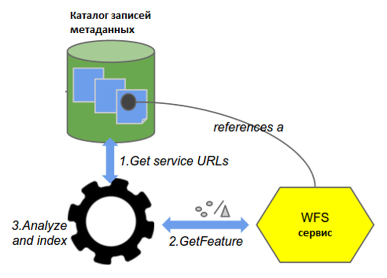
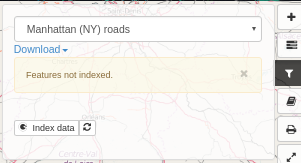
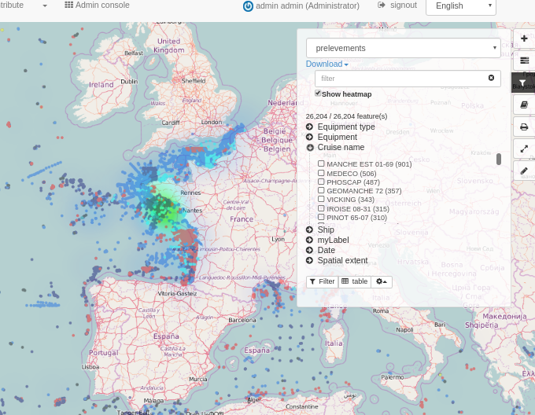

# Анализ и визуализация данных {#analyzing_data}

## Данные из WFS 

Все данные, описанные в записях метаданных и доступные через [WFS](https://live.osgeo.org/archive/8.0/ru/standards/wfs_overview.html), могут быть проанализированы для улучшения поиска данных и их визуализации на карте.
Каталог анализирует WFS-объекты и **индексирует** их.



Elasticsearch (одна из самых популярных поисковых систем в области Big Data, масштабируемое нереляционное хранилище данных с открытым исходным кодом, аналитическая NoSQL-СУБД с широким набором функций полнотекстового поиска) 
необходимо установить и настроить (см. [Установка поисковой платформы](../../install-guide/installing-index.md)).

Когда информация о данных будет получена с WFS-сервера, становится доступна фильтрация. 
Интерфейс фильтрации предоставляет возможность разбиения набора данных на группы (фасетирования), а также возможность экспорта. 
Вьюер карт пытается подключиться к службе WFS, заменяя в URL службы WMS на WFS. Если такой запрос на WFS-сервис успешный, 
панель фильтрации предоставляет возможность индексировать объекты у рассматриваемого набора данных. Пользователь должен быть авторизован, 
чтобы запустить процесс индексирования.



После индексации все пользователи могут получить доступ к меню фильтрации, обеспечивающему:

- текстовый поиск по всем полям набора данных
- элемент управления для отображения тепловой карты (heatmap)
- разбиения набора данных по всем полям (автоматическое вычисление границ диапазона для чисел)
- отображения всех значений в таблице
- применять фильтры к слоям WMS, используя SLD



Нажмите на меню таблицы, чтобы отобразить атрибуты. Дважды щелкните строку в таблице, чтобы изменить масштаб атрибута.


Также можно применять пространственные фильтры.


## Настройка типов объектов

По умолчанию панель фильтров формируется на основе индекса Elasticsearch. Но её можно настроить для определенного WFS-объекта из набора данных.

Настройка осуществляется с помощью конфигурационного JSON-файла, вставленного в раздел gmd:applicationProfile онлайн-ресурса в метаданных.

Вот параметры:

```json
{
  «fields": [{
    «name": «PNT_PROF»,
    // non disponible actuellement
    «type": «double»,
    «fq» : {
      «facet.interval": «PNT_PROF_d»,
      «facet.interval.set": [«[0,10]», «(10,10000]»],
     или
      «facet.range": «PNT_PROF_d»,
      «facet.range.start": «0»,
      «facet.range.end": «10000»,
      «facet.range.gap": «300»
     или
      «facet.range": «PNT_PROF_d»,
      «facet.range.classes": «5» // Получаем min, max и вычисляем разрыв по 5 классам
    }
  }, {
    «name": «GRIDCODE»
  }, {
    «name": «LABEL»,
    «label» : { „fr“: «monLabel», „en“: «myLabel"}
  }],
  «tokenize": { «GRIDCODE»: »,», „PARCELLE“: «/"},
  «heatmap": true
}
```

Пользователь может:
- ограничить поля, используемые для фильтра
- указывать собственные диапазоны для числовых значений
- задать свою метку
- управлять токенизированными полями
- включить тепловую карту
