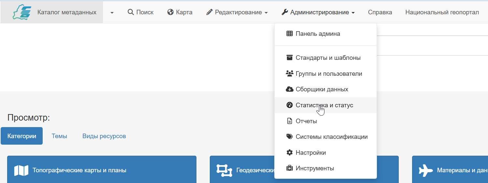

# Статистика по ресурсам в каталоге

Панель администратора предоставляет широкий набор инструментов для анализа состояния каталога и поведения пользователей. Эта данные помогают администраторам групп понимать, какие данные наиболее востребованы, какие поисковые запросы не дают результатов, и каково общее состояние метаданных, содержащихся в записях в их группе.

Доступ к статистике предоставляется через `Панель администратора`, во вкладке `Статистика и статус`.

После перехода откроется страница с выбором соответствующего функционала:

- [Статус](#статус)
- [Анализ ссылок записей](#анализ-ссылок-записей)
- [Информация](#информация)
- [Версии](#версии)
- [Последние отзывы пользователей](#последние-отзывы-пользователей)
- [Статистика содержания](#статистика-содержания)

## Статус

Здесь приведена техническая информация, важная для диагностики производительности.

## Анализ ссылок записей

Это критически важный инструмент для контроля качества связей между ресурсами. Он проверяет валидность URL-адресов внутри метаданных в записях группы.

Администратор может получить отчёт о ресурсах (онлайн-ресурсы, ссылки на скачивание), которые возвращают ошибки (404 Not Found, 500 Server Error), а также сформировать статистику по используемым протоколам (WWW:DOWNLOAD, OGC: WMS и т.д.).

Анализ этих данных помогает исправить нерабочие ссылки для корректности предоставления ресурсов в группе.

## Информация

В этой вкладке администратор может узнать информацию о конфигурации программного продукта в целом:

- расположение ключевых директорий в файловом хранилище операционной системы,
- сведения о применяемой базе данных,
- сведения о поисковой системе,
- сведения о версии и сборке программного продукта,
- информация об операционной системе.

Анализ этих данных позволяет администратору внести корректировки в случае неверного отображения сведений из записей метаданных, некорректно работающих функций программного обеспечения, в том числе индексации. 

## Версии

В данной вкладке администратору доступны сведения системы управления версиями записей метаданных. Пользователь может отсортировать записи, указав искомого автора или владельца записи, даты до и после конкретной даты, а также прямо указать UUID-идентификатор записи.

## Последние отзывы пользователей

Данный инструмент собирает в одном месте все комментарии и отзывы, которые другие пользователи оставили к записям метаданных, опубликованным в группе администратора. 

!!! note "Внимание"
    Отзывы подлежат своевременной модерации, ответственность за которую несут администраторы групп Каталога метаданных. 

## Статистика содержания 

В этом разделе можно получить количественный обзор наполнения контента группы.

- Общее количество записей метаданных.
- Распределение записей по статусу (черновик, утверждено, архив), по стандартам и по пользователям.
- Выборка наиболее популярных записей в каталоге круппы.
