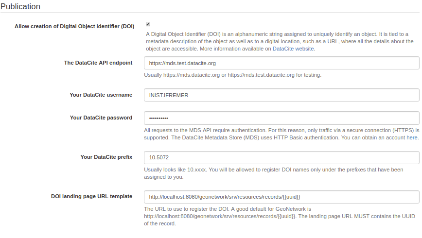
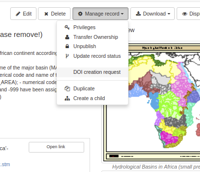
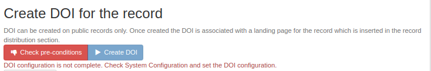
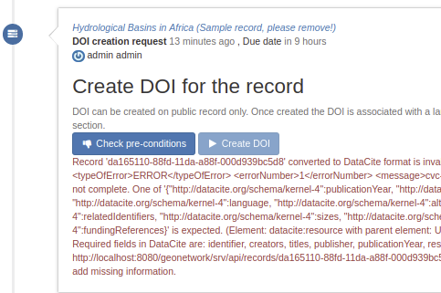
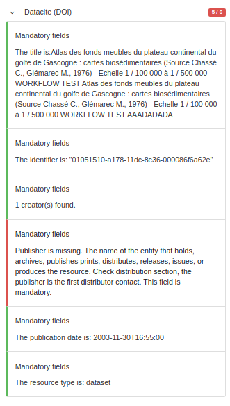
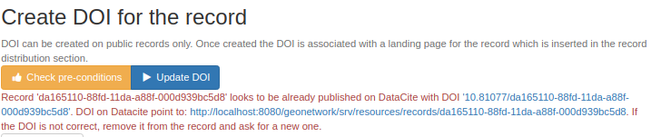
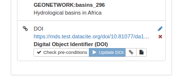
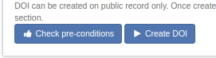
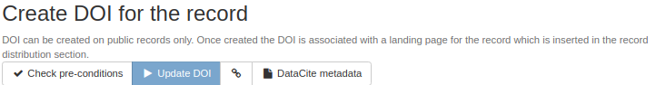

# Идентификатор цифрового объекта (DOI) {#doi}

Идентификатор цифрового объекта (DOI) - это буквенно-цифровая строка, присваиваемая для уникальной идентификации объекта. Он привязан к описанию метаданных объекта, а также к цифровому местоположению, например URL, где доступны все сведения об объекте. Более подробную информацию можно найти на сайте [DataCite](https://datacite.org/create-dois/).

## Настройка

Каталог поддерживает создание DOI (Digital Object Identifier) с помощью:

- [DataCite API](https://support.datacite.org/docs/mds-api-guide).
- API издательского офиса ЕС <https://ra.publications.europa.eu/servlet/ws/doidata?api=medra.org>.

Настройте точку доступа к API в `Панели администратор` - `Настройки` и найдите раздел `Публикация`:

Запись в формате DataCite можно загрузить из API, используя: <http://localhost:8080/geonetwork/srv/api/records/da165110-88fd-11da-a88f-000d939bc5d8/formatters/datacite?output=xml>

## Создание DOI

После настройки, DOI может быть создан с помощью интерфейса. DOI создается по запросу. Это означает, что пользователь должен запросить создание DOI. Он может быть создан:
- Пользователем, создавшим метаданные.
- Пользователем с профилем Reviewer (рецензент) в группе владельцев метаданных.
- Администратором

При создании задачи рецензент группы получает уведомление по электронной почте (по умолчанию, может быть настроен только для администратора с помощью уровня уведомления задачи).

Задача назначается конкретному пользователю. Дополнительно можно указать дату выполнения и комментарий:

После отправки задания владелец задачи получает уведомление по электронной почте (если настроен почтовый сервер, см. консоль администратора --> настройки). Затем задание можно разрешить в консоли администратора --> информация --> раздел версионирования.

Если конфигурация отсутствует или неверна, сообщается об ошибке:

Для создания DOI задача состоит из двух шагов:

- Сначала проверьте, все ли предварительные условия соблюдены ([DataCite](https://datacite.org/create-dois/)).

Формат DataCite требует наличия некоторых обязательных полей:

- Идентификатор (с обязательным подсвойством Тип)
- Создатель (с необязательными подсвойствами "имя", "фамилия", "идентификатор имени" и "принадлежность")
- Название (с необязательными подсвойствами типа)
- Издатель
- Год публикации
- Тип ресурса (с обязательным подсвойством общего описания типа)

Сопоставление со стандартами ISO выглядит следующим образом:

| Property | ISO 19139 | ISO 19115-3 |
|-----------------|-----------------------------------------------------------------------------------------------------------------------|-----------------------------------------------------------------------------------------------------------------------|
| Идентификатор | ``gmd:MD_Metadata/gmd:fileIdentifier/*/text()`` | ``mdb:MD_Metadata/mdb:metadataIdentifier/*/mcc:code/*/text()`` |
| Создатель | ``gmd:identificationInfo/*/gmd:pointOfContact`` с ролью 'pointOfContact' или 'custodian' | ``mdb:identificationInfo/*/mri:pointOfContact`` с ролью 'pointOfContact' или 'custodian' |
| Название | ``gmd:identificationInfo/*/gmd:citation/*/gmd:title`` | ``mdb:identificationInfo/*/mri:citation/*/cit:title`` |
| Издатель | ``gmd:distributorContact[1]/*/gmd:organisationName/gco:CharacterString`` | ``mrd:distributorContact[1]/*/cit:party/*/cit:organisationName/gco:CharacterString`` |
| PublicationYear | ``gmd:identificationInfo/*/gmd:citation/*/gmd:date/*[gmd:dateType/*/@codeListValue = 'publication'`` | ``mdb:identificationInfo/*/mri:citation/*/cit:date/*[cit:dateType/*/@codeListValue = 'publication'`` |
| ResourceType | ``gmd:hierarchyLevel/*/@codeListValue`` | mdb:metadataScope/*/mdb:resourceScope/*/@codeListValue`` |

Сопоставление может быть настроено в:

- ISO19139 `schemas/iso19139/src/main/plugin/iso19139/formatter/datacite/view.xsl`.
- ISO19115-3.2018 `schemas/iso19139/src/main/plugin/iso19139/formatter/datacite/view.xsl`.

Более подробную информацию о формате см. по адресу <http://schema.datacite.org/meta/kernel-4.1/doc/DataCite-MetadataKernel_v4.1.pdf>.

DataCite API возвращает ошибку проверки XSD.

Каталог также позволяет применять валидацию DataCite в редакторе:

DOI может быть уже присвоен записи:

В этом случае DOI может быть обновлен. Если DOI уже присвоен записи метаданных, редакторы также могут обновить DOI из редактора:

После проверки создайте DOI

После создания будет доступна ссылка на DOI и на документ DataCite:

Затем DOI добавляется в запись метаданных:

