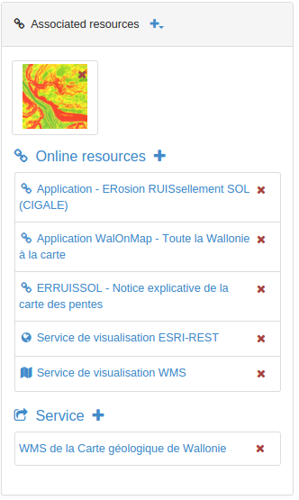
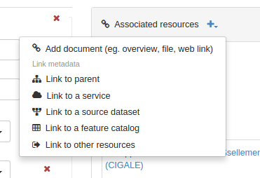

# Связывание со сторонними ресурсами {#associating_resources}

В режиме редактирования запись метаданных можно связывать со сторонними ресурсами с помощью панели `Связанные ресурсы`.

С помощью панели можно создавать, редактировать и удалять связанные ресурсы различных типов. Здесь же находиться список текущих связанных ресурсов, сгруппированных по типам.

- Чтобы добавить новый онлайн-ресурс, нажмите `Добавить ссылку`.

Вы можете связывать различные типы ресурсов:

- [Документов](linking-documents.md)
- [Другие записи](linking-records.md)
- [Идентификатор цифрового объекта (DOI)](doi.md)
- [Цитировать ресурс](cite.md)