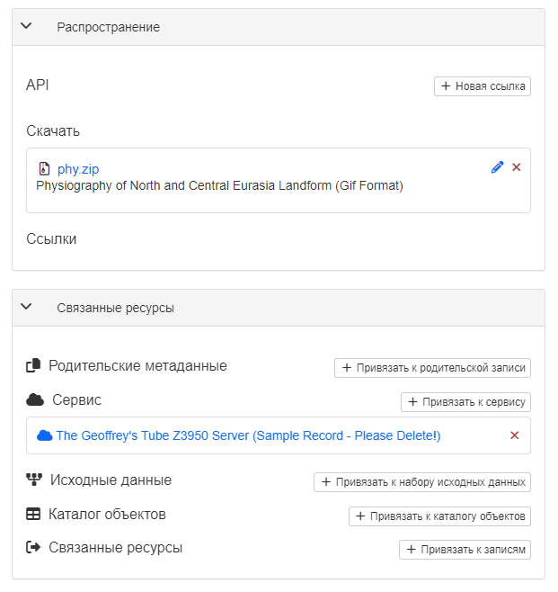
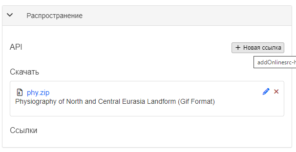

# Связывание со сторонними ресурсами {#associating_resources}

Записи метаданных можно связывать со сторонними ресурсами с помощью панелей `Распространение` и `Связанные ресурсы` в режиме редактирования. 

С помощью панели можно создавать, редактировать и удалять связанные ресурсы различных типов. 
Здесь же находиться список текущих связанных ресурсов, сгруппированных по типам.

- Чтобы добавить новый онлайн-ресурс, в панели `Распространение` нужно нажать `Новая ссылка`.

К записью метаданных можно связывать и другие типы ресурсов:

- [Документов](linking-documents.md)
- [Другие записи](linking-records.md)
- [Идентификатор цифрового объекта (DOI)](doi.md)
- [Цитировать ресурс](cite.md)