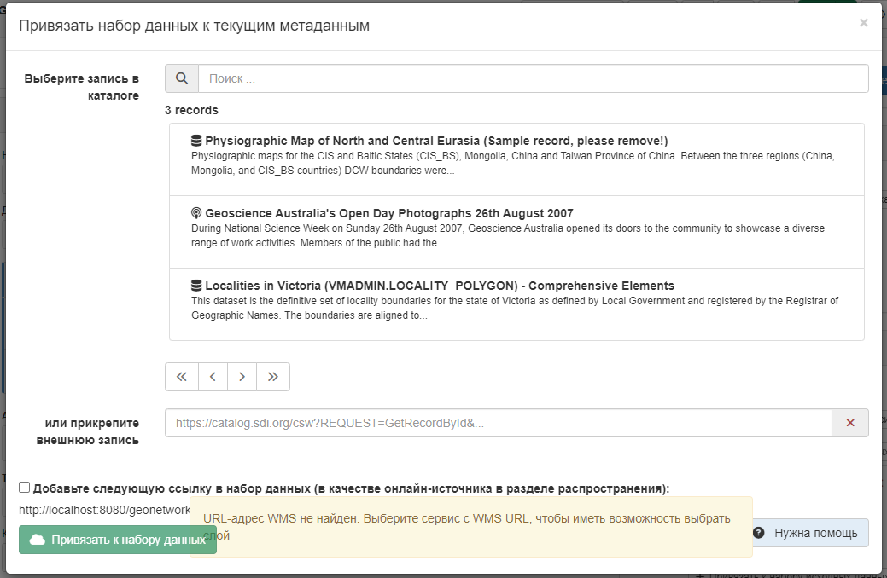

# Каталог объектов {#linking-feature-catalog}

Каталог объектов описывает модель данных набора данных со списком таблиц, атрибутов, определений, списком значений и т.д. Каталоги объектов могут быть описаны:

- как документ (например, PDF) и связан с записью метаданных (см. [Связывание документов](linking-online-resources.md#linking-online-resources-doc))
- в виде записи и описаны с использованием стандартов ISO19110.

Нажмите на `Привязать к каталогу объектов`, чтобы открыть список записей, в котором перечислены все каталоги объектов. 
Чтобы связать 2 документа, нужно нажать `Привязать к каталогу объекту`.

