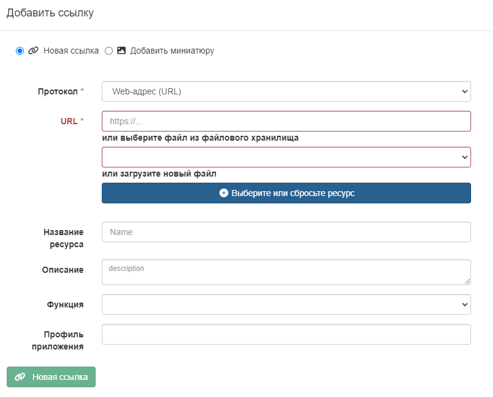
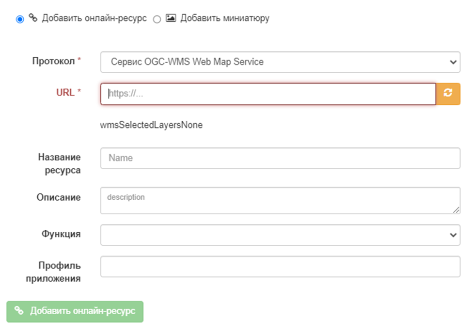
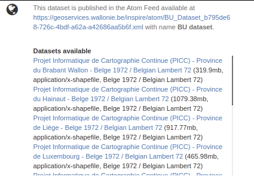

# Связывание веб-сайтов, веб-сервисов, \... с помощью URL {#linking-online-resources}

Этот раздел относится в основном к записям ISO19139 и частично к стандартам Dublin Core (только документы могут быть связаны в стандарте Dublin Core).

## Связывание документа {#linking-online-resources-doc}

Для связывания документов можно использовать 2 подхода:

- путем предоставления URL-адреса
- путем загрузки документа.

Чтобы создать новую ссылку, нажмите на кнопку `Распространение` - `Новая ссылка`.



Чтобы связать с онлайн-ресурсом, установите следующие свойства:

- `Протокол` для описания типа прикрепленного документа и способа передачи данных (по умолчанию `Веб-адрес (URL)`)
- `URL` путь к целевому документу. Это может быть любой тип ссылок, например <http://>, <ftp://>, <file:///>, \...
- `Название ресурса` является необязательным и предоставляет метку для создания гиперссылки
- `Описание` является необязательным и предоставляет более подробную информацию о ссылке.

Чтобы загрузить файл с компьютера, нажмите на кнопку `Выберите или сбросьте ресурс` и выберите документ, 
либо перетащите его во всплывающее окно. В этом случае протокол скрыт и имеет значение `WWW:DOWNLOAD`.

В зависимости от потребностей, можно добавить более специфические ссылки, которые будут связаны с различными действиями и отображаться в приложениях.

## Связывание слоя WMS {#linking-wms-layer}

Для просмотра записи в программе просмотра карт может потребоваться добавить ссылку на один или несколько WMS-сервисов, публикующих набор данных. Онлайн-ресурс кодируется следующим образом в стандарте ISO19139:

``` xml
<gmd:onLine xmlns:gmd="http://www.isotc211.org/2005/gmd"
            xmlns:gco="http://www.isotc211.org/2005/gco">
   <gmd:CI_OnlineResource>
      <gmd:linkage>
         <gmd:URL>https://download.data.grandlyon.com/wms/grandlyon</gmd:URL>
      </gmd:linkage>
      <gmd:protocol>
         <gco:CharacterString>OGC:WMS</gco:CharacterString>
      </gmd:protocol>
      <gmd:name>
         <gco:CharacterString>cad_cadastre.cadsubdivisionsection</gco:CharacterString>
      </gmd:name>
      <gmd:description>
         <gco:CharacterString>Subdivision de section cadastrale (Plan cadastral informatisé du Grand Lyon)(OGC:WMS)</gco:CharacterString>
      </gmd:description>
   </gmd:CI_OnlineResource>
</gmd:onLine>
```

Чтобы добавить слой WMS:

- выберите протокол `Сервис OGC-WMS Web Map Service`,
- задайте URL-адрес сервиса,
- затем мастер запросит сервис для получения списка слоев
- выберите один или несколько слоев из списка или задайте их вручную.



## Связывание таблицы базы данных или файла ГИС в сети {#linking-online-resources-georesource}

Чтобы сослаться на ГИС-файл или таблицу базы данных, пользователь может загрузить или сослаться на этот ресурс (см. [Связывание документов](linking-online-resources.md#linking-online-resources-doc)). Тип протокола зависит от типа связанного ресурса:

| Тип ресурса | Загружаемый векторный файл (например, заархивированный Shapefile) |
|------------------|-------------------------------------------------------------------------------------------------------------------------------------------------|
URL | URL | URL файла, созданный после загрузки в каталог. например <http://localhost:8080/geonetwork/srv/eng/resources.get?id=1631&fname=CCM.zip&access=private> |
| Протокол | WWW:DOWNLOAD |
| Имя | Имя файла (только для чтения) |

| Тип ресурса | Векторный файл в сети |
|------------------|--------------------------------------------------------------------|
| URL | Путь к файлу. например, <file:///shared/geodata/world/hydrology/rivers.shp> |
| Протокол | <FILE:GEO> или <FILE:RASTER> |
| Имя | Описание файла |

| Тип ресурса | Вектор (таблица PostGIS)|
|------------------|------------------------------------------------------|
| URL | jdbc:postgresql://localhost:5432/login:<password@db> |
| Протокол | DB:POSTGIS |
| Имя | Имя таблицы |

При наличии информации о базе данных или файле в локальной сети может быть уместно скрыть эту информацию для публичных пользователей (см. [Ограничение информации к разделам метаданных](../publishing/restricting-information-to-metadata-sections.md)).

## Связывание данных с помощью ATOM-каналов {#linking-data-using-atom-feed}

Если организация предоставляет каналы ATOM для облегчения доступа к данным, записи метаданных могут ссылаться на эти каналы. Пользователи могут ссылаться на сервисный фид службы и на фид набора данных в записи набора данных.

``` xml
<gmd:MD_DigitalTransferOptions>
 <gmd:onLine>
  <gmd:CI_OnlineResource>
   <gmd:linkage>
    <gmd:URL>http://www.broinspireservices.nl/atom/awp.atom</gmd:URL>
   </gmd:linkage>
   <gmd:protocol>
    <gco:CharacterString>INSPIRE Atom</gco:CharacterString>
   </gmd:protocol>
   <gmd:name>
    <gco:CharacterString>gdn.Aardwarmtepotentie</gco:CharacterString>
   </gmd:name>
  </gmd:CI_OnlineResource>
 </gmd:onLine>
</gmd:MD_DigitalTransferOptions>
```

После регистрации в метаданных лента ATOM будет отображаться в представлении записи:


Пользователи могут выбрать сервис, список доступных наборов данных будет извлечен, а ссылки на скачивание отображены пользователю. Фид набора данных может содержать одну или несколько загрузок:



Примеры:

- [NGR National Georegister](https://www.nationaalgeoregister.nl/geonetwork/srv/dut/catalog.search#/search?any=atom&fast=index), [Statistics Netherlands Land Use 2015 ATOM](https://www.nationaalgeoregister.nl/geonetwork/srv/dut/catalog.search#/metadata/a657f732-e1b3-4638-9933-67cab10d9081).

Каталог также предоставляет возможность создавать ATOM-каналы для сервисов и наборов данных на основе записей метаданных. Чтобы сделать это, проверьте ATOM API (см. [OpenSearch and INSPIRE ATOM](../../api/opensearch.md)). Набор данных GML может быть представлен в следующей кодировке, чтобы быть опубликованным в ленте данных ATOM:

``` xml
<gmd:transferOptions>
   <gmd:MD_DigitalTransferOptions>
      <gmd:unitsOfDistribution>
         <gco:CharacterString>B</gco:CharacterString>
      </gmd:unitsOfDistribution>
      <gmd:transferSize>
         <gco:Real>428973180</gco:Real>
      </gmd:transferSize>
      <gmd:onLine>
         <gmd:CI_OnlineResource>
            <gmd:linkage>
               <gmd:URL>https://download.data.public.lu/resources/inspire-annex-i-theme-addresses-addresses/20191118-115245/ad.address.gml</gmd:URL>
            </gmd:linkage>
            <gmd:protocol>
               <gco:CharacterString>WWW:DOWNLOAD-1.0-http--download</gco:CharacterString>
            </gmd:protocol>
            <gmd:applicationProfile>
               <gco:CharacterString>INSPIRE-Download-Atom</gco:CharacterString>
            </gmd:applicationProfile>
            <gmd:name>
               <gmx:MimeFileType type="application/octet-stream">AD.Address.gml</gmx:MimeFileType>
            </gmd:name>
            <gmd:description>
               <gco:CharacterString></gco:CharacterString>
            </gmd:description>
            <gmd:function>
               <gmd:CI_OnLineFunctionCode codeList="http://standards.iso.org/ittf/PubliclyAvailableStandards/ISO_19139_Schemas/resources/codelist/ML_gmxCodelists.xml#CI_OnLineFunctionCode"
                                          codeListValue="download">download</gmd:CI_OnLineFunctionCode>
            </gmd:function>
         </gmd:CI_OnlineResource>
      </gmd:onLine>
   </gmd:MD_DigitalTransferOptions>
</gmd:transferOptions>
```

Примеры:

- Портал INSPIRE Великого Герцогства Люксембург / [INSPIRE - Приложение I Тематические адреса - Адреса](https://catalog.inspire.geoportail.lu/geonetwork/srv/fre/catalog.search#/metadata/F22B07FC-E961-4985-BB75-6A1548319C8A)

Справочные документы:

- [Техническое руководство INSPIRE для служб загрузки](https://inspire.ec.europa.eu/documents/technical-guidance-implementation-inspire-download-services).