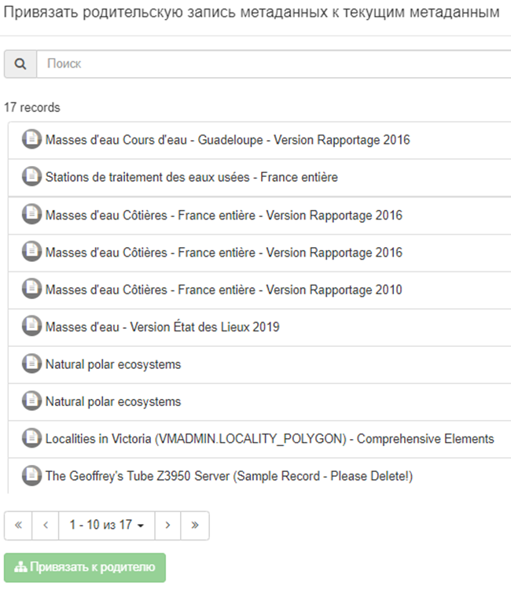

# Группировка записей метаданных (связь родитель/ребенок) {#linking-parent}

В некоторых ситуациях описываемые данные могут иметь одну и ту же спецификацию (например, почвенно-растительный покров за разные годы) 
и в совокупности образовывать коллекцию. Чтобы сгруппировать такой набор записей, общее описание коллекции может быть сделано в родительских метаданных. 
Описание родительских метаданных затем может быть прикреплено ко всем дочерним записям метаданных. 
Для этого нужно выбрать `Связанные ресурсы` - `Привязать к родительской записи`.

- Почвенно-растительный покров
    - Почвенно-растительный покров 2002
    - Почвенно-растительный покров 2012
    - \...

Отношения "родитель/ребенок" могут быть установлены в записях ISO19139 и Dublin Core. 
В ISO19139 ссылка на родительскую запись кодируется в дочерней записи следующим образом:

``` xml
<gmd:parentIdentifier>
   <gco:CharacterString>78f93047-74f8-4419-ac3d-fc62e4b0477b</gco:CharacterString>
</gmd:parentIdentifier>
```

Отношения "родитель/ребенок" в ISO19139 также могут быть закодированы с помощью агрегаций (смотреть [Другие типы ресурсов](linking-others.md)).

При создании такой связи пользователи смогут перемещаться по иерархии записей.


Нажмите на `Связать с родителем`, чтобы получить доступ к панели, предоставляющей простой поиск для выбора целевых родительских метаданных


