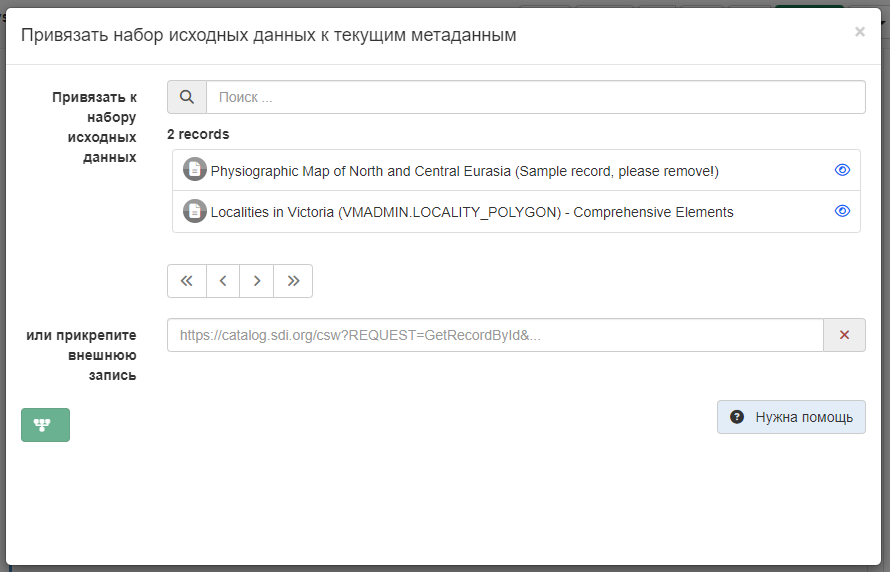

# Ссылки на источники набора данных {#linking-source}

Когда набор данных создается на основе другого набора или когда карта состоит из наборов данных, 
редакторы могут указать эту связь в разделе записи (используя стандарт ISO19139 или ISO19115-3), добавив источники.
Для этого нужно выбрать `Связанные ресурсы` - `Привязать к набору исходных данных`.

