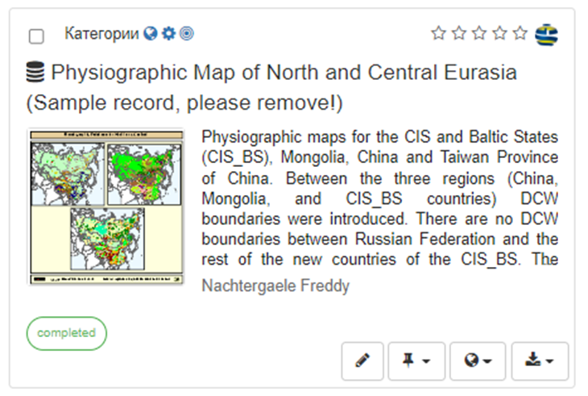
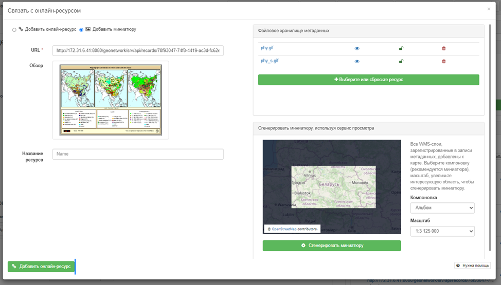
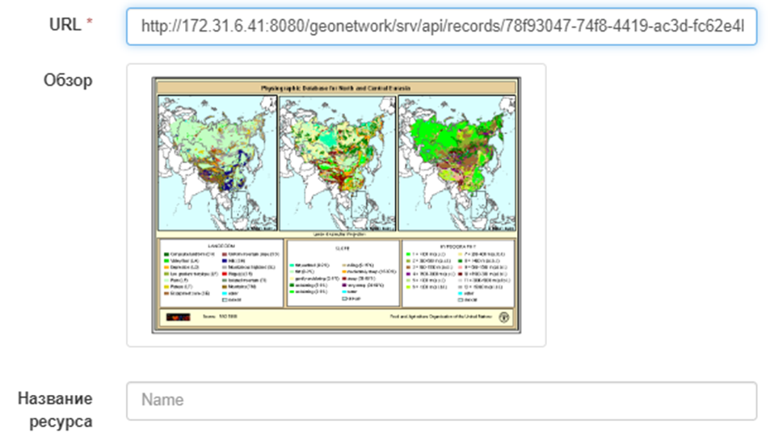
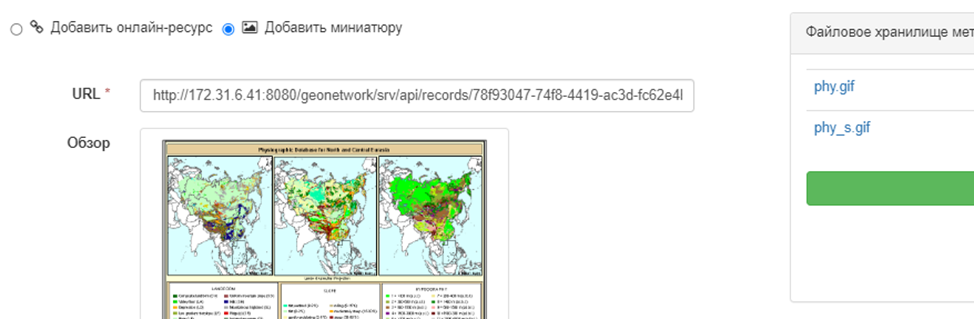
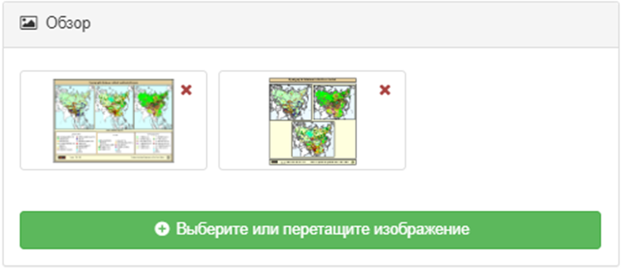
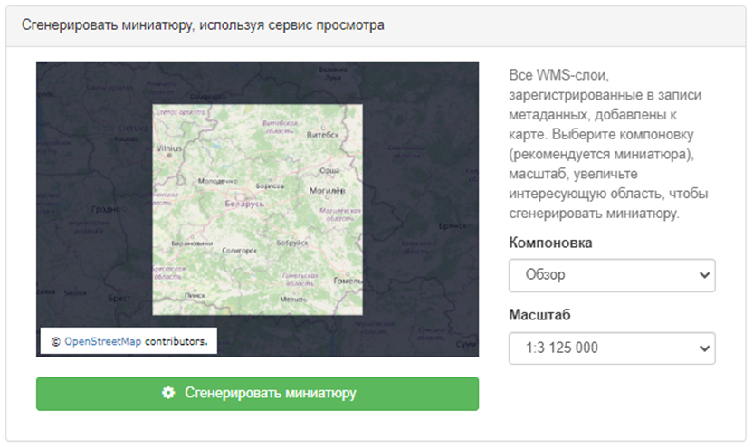

# Иллюстрация связанных ресурсов {#linking-thumbnail}

Чтобы помочь пользователю определить интересующую запись среди всех связанных ресурсов, можно создать иллюстрацию (миниатюру, аватар-изображение) связанного ресурса. 
Например, если запись метаданных описывает некоторый набор географических данных, аватар-изображение может представлять собой изображение карты.

К связанному ресурсу можно привязать несколько иллюстраций.

Иллюстрации отображаются в результатах поиска и в представлении метаданных:

Чтобы создать добавить иллюстрацию (миниатюру), нужно выбрать `Новая ссылка` - `Добавить миниатюру`. Иллюстрацию можно добавлять из трех источников:

- из URL-адреса в Интернете
- Из файла, прикрепленного к метаданным
- Из файла, созданного с использованием слоев WMS

## Ссылка на обзор с помощью URL-адреса

Если ресурс доступен в виде изображения в Интернете, его можно напрямую связать с записью метаданных. 
К связанному ресурсу также можно добавить необязательное описание:

Если ресурс из интернета не подтягивает с собой изображение, с помощью кнопки `Добавить миниатюру` нужно прикрепить изображение (png, gif, jpeg):

Можно связать столько изображений, сколько необходимо.

## Создание миниатюры с использованием слоев WMS {#linking-thumbnail-from-wms}

Если слой WMS зарегистрирован в текущей записи метаданных (см. [Связывание WMS слоя](linking-online-resources.md#linking-wms-layer)), можно создать миниатюру, используя ее поверх карты базового слоя. 
Выберите вкладку `Добавить миниатюру` и выберите область, которая будет напечатана на миниатюре. Созданное изображение добавляется в хранилище файлов.

