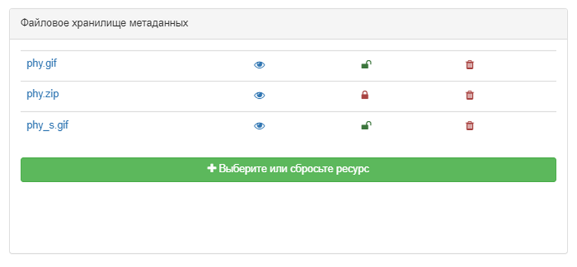

# Загрузка документов с компьютера {#associating_resources_filestore}

Пользователь может прикрепить вложение (документ, фотографию и др.) к записи метаданных. 
Вложения сохраняются в хранилище файлов программы, которое может содержать любые типы файлов.

Чтобы прикрепить файл, нажмите `Связанные ресурсы` - `Новая ссылка` и выберите файл или перетащите файл. 
Файлы хранятся в папке в каталоге данных (см. [Настройка каталога данных](../../install-guide/customizing-data-directory.md)). 
На метаданные приходится одна папка, содержащая:

- папку `public` с файлами, доступными всем пользователям
- папку `private` с файлами, доступными только идентифицированному пользователю с привилегией скачивания (см. [Управление привилегиями](../publishing/managing-privileges.md)).

Из хранилища файлов можно:

- нажать на имя файла, чтобы указать URL-адрес текущего документа для прикрепления
- нажать на значок глаза, чтобы просмотреть документ
- нажать на шкафчик, чтобы изменить видимость документа
- нажать на крестик, чтобы удалить файл.

Файл, загруженный таким образом, будет экспортирован в файл экспорта метаданных (MEF). 
Поэтому его URL-адрес не будет автоматически добавлен в метаданные. 
URL добавляется при прикреплении документа к определенному элементу метаданных (например обзор, отчет, легенда).

## Конфигурация хранилища файлов

По умолчанию максимальный размер файла установлен на 100 Мб. 
Это ограничение задается в файле `/services/src/main/resources/config-spring-geonetwork.xml` с помощью параметра `maxUploadSize`.
