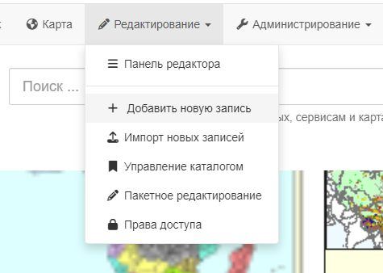
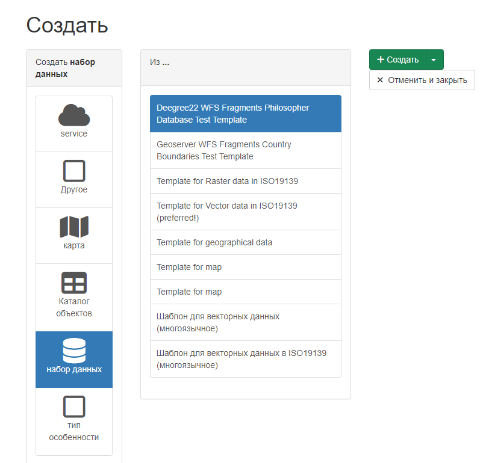

# Создание записи метаданных {#creating-metadata}

В этом разделе описан процесс добавления в каталог новых записей метаданных и связанных с ними данных или сервисами.

## Прежде чем начать

Чтобы добавить или отредактировать метаданные, пользователь:

- Должен иметь профиль `Редактор` или выше.
- Должен быть членом группы, для которой будет добавлена информация.

Нужный профиль может назначить администратор каталога.

1.  В главном меню выберите `Редактирование` - `Добавить новую запись`.

    

2.  Откроется окно выбора шаблона. Слева нужно выбрать тип ресурса, который будет описывать метаданные (Карта, Каталого пространственных объектов, Набор данных, Сервис, Тип объекта).
3.  В появившемся списке шаблонов метаданных для выбранного типа ресурса выберите подходящий шаблон (см. [Управление шаблонами](managing-templates.md)).
4.  Последним шагом нужно выбрать группу из выпадающего списка и нажить `Создать`, чтобы открыть окно создания записи метаданных.
    

!!! Примечание

    Если в каталоге определена только одна группа, она будет выбрана по умолчанию.

В открывшемся окне нужно:

- Заполнить поля, предусмотренные по умолчанию в шаблоне.
- Создать логотип (изображение-аватар) созданной записи метаданных, чтобы проиллюстрировать их в результатах поиска.
- Нажать `Сохранить` в правом верхнем углу.
