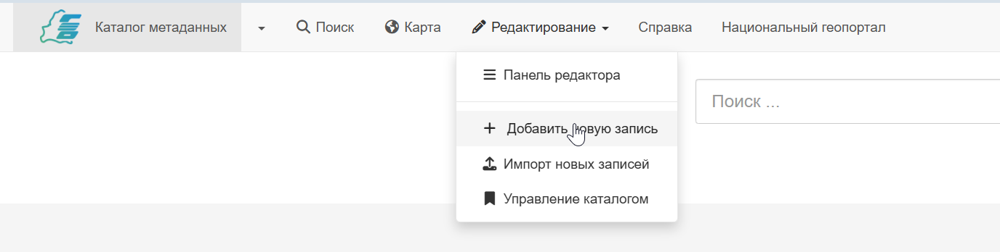
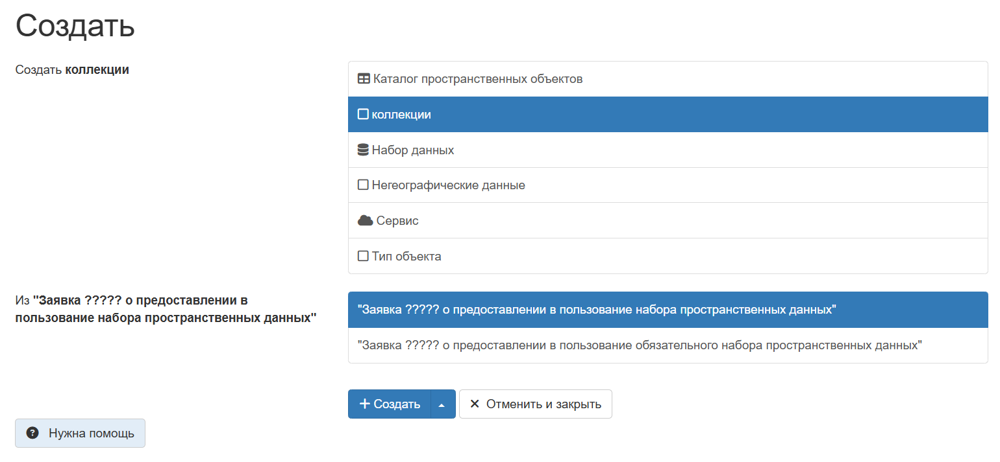

# Создание записи метаданных {#creating-metadata}

В этой статье описан процесс добавления в каталог новых записей метаданных и связанных с ними данных или сервисами.

## Прежде чем начать

Чтобы добавить или отредактировать метаданные, пользователь:

- Должен иметь профиль `Редактор` или выше.
- Должен быть членом группы, для которой будет добавлена информация.

Нужный профиль может назначить администратор Каталога группы или Администратор Национального геопортала.

1.  В главном меню выберите `Редактирование` - `Добавить новую запись`.

    

2.  Откроется окно выбора шаблона. Шаблоны определены Администратором Национального геопортала на уровне Каталогов групп.

    

3. Под словом **Создать** пользователю доступны к выбору создания следующие типы объектов и соответствующие им заявки:

|Тип объекта|Возможные шаблоны записей|Описание|
|:---|:---|:---|
|коллекции|Заявка о предоставлении в пользование набора пространственных данных Заявка о предоставлении в пользование обязательного набора пространственных данных|Описание 1 Описание 2|
|Набор данных|Шаблон базы геоданных   Шаблон мозаики   Шаблон ||
|Негеографические данные|||
|Сервис|||

Слева нужно выбрать тип ресурса, который будет описывать метаданные (Карта, Каталого пространственных объектов, Набор данных, Сервис, Тип объекта).
3.  В появившемся списке шаблонов метаданных для выбранного типа ресурса выберите подходящий шаблон (см. [Управление шаблонами](managing-templates.md)).
4.  Последним шагом нужно выбрать группу из выпадающего списка и нажить `Создать`, чтобы открыть окно создания записи метаданных.
    

!!! note "Примечание"

    Если в каталоге определена только одна группа, она будет выбрана по умолчанию.

В открывшемся окне нужно:

- Заполнить поля, предусмотренные по умолчанию в шаблоне.
- Создать логотип (изображение-аватар) созданной записи метаданных, чтобы проиллюстрировать их в результатах поиска.
- Нажать `Сохранить` в правом верхнем углу.
