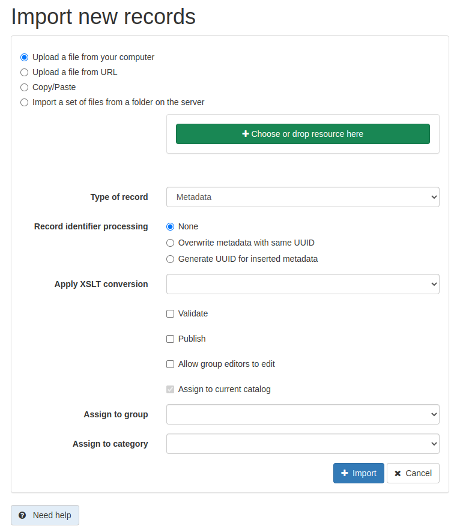

# Импорт метаданных {#import1}

Пользователь-редактор может импортировать метаданные в каталог в различных форматах: XML, MEF или ZIP (см. [Формат обмена метаданными MEF](../../annexes/mef-format.md)).

## Прежде чем начать

Для доступа к метаданным пользователь должен иметь профиль `Редактор`.

1.  В главном меню выберите `Редактирование` - `Импорт новых записей`.

    

    Используя страницу импорта новых записей, можно:

    - выбрать `Загрузить файл с компьютера` и выбрать файл XML или MEF из папки на локальном компьютере;
    - выбрать `Загрузить файл по URL` и указать URL-адрес для импорта данных;
    - выбрать `Копировать/Вставить` и скопировать XML-документ в текстовую область;
    - выбрать `Импортировать набор файлов из папки на сервере` и задать путь к папке на сервере, на котором запущен GeoNetwork.

    Чтобы импортировать несколько файлов за раз, следует использовать опции формата MEF или импорта с сервера.

2.  После определения типа импорта нужно настроить другие параметры импорта:

    

    - `Тип записи`:  

        - `Метаданные` при загрузке обычной записи метаданных.
        - `Шаблон`, если загруженная запись метаданных будет использоваться в качестве шаблона.

    - `Обработка идентификатора записи` определяет, как обрабатывать потенциальные столкновения между UUID загружаемой записи и UUID записей метаданных, уже присутствующих в каталоге. Доступны 3 стратегии:

        - `Ничего`: Если запись метаданных с таким же UUID уже присутствует в каталоге, возвращается сообщение об ошибке.
        - `Перезаписать метаданные с тем же UUID`: все существующие в каталоге записи метаданных, имеющие тот же UUID, что и загруженная запись, будут перезаписаны. UUID загружаемой записи остается неизменным.
        - `Генерировать UUID для вставленных метаданных`: загруженная запись получит новый UUID.

    - `Применить XSLT-конвертацию` - позволяет преобразовать загруженную запись с помощью таблицы стилей XSLT. Предоставляется список преобразований по умолчанию. Выбранное преобразование должно быть совместимо со стандартом загружаемой записи (см. раздел [Добавление XSLT-преобразования для импорта](../workflow/batchupdate-xsl.md#customizing-xslt-conversion)).
    - `Проверить` - запускает проверку записи перед ее загрузкой. В случае ошибки импорт запись отклоняется и сообщается об ошибке.
    - `Опубликовать` - при выборе это опции запись метаданных будет опубликована в каталоге.
    - `Разрешить редакторам группы редактировать` - если запись будет добавлена к какой-то группе, то редакторы этой группы смогут её редактировать.
    - `Прикрепить к текущему каталогу` - назначает текущий каталог в качестве источника для записи, в случае если в файле MEF указан другой источник.
    - `Прикрепить к группе` - определяет группу загружаемой записи.
    - `Присвоить категорию` - определяет локальную категорию, которая будет присвоена загружаемой записи.

3. Нажмите `Импорт`, чтобы запустить импорт. После обработки появится сводка, содержащая следующие сведения:

    - общее количество импортированных метаданных;
    - сообщения об ошибках;
    - если импортирована только одна запись, предоставляется ссылка на эту запись.
