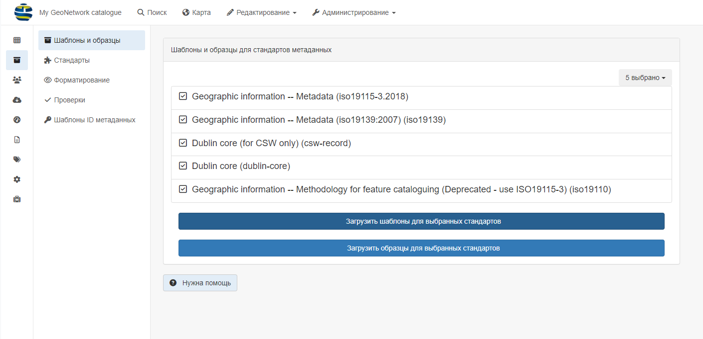

# Управление шаблонами {#creating-templates}

Для упрощения процесса создания новых записей метаданных в системе предусмотрены шаблоны. 
Шаблон представляет собой форму, содержащую обязательные для заполнения поля и поля, рекомендованные, но необязательные к заполнению. 
Остальные поля в форме скрыты, но при необходимости они также могут быть использованы. 
Поля с часто повторяющимся содержанием, например, контактной информацией, предварительно заполнены значениями по умолчанию.

## Создание и управление шаблонами

Пользователь может:

- Управлять шаблонами в каталоге так же, как и записями метаданных, с помощью специального тега 'template'.
- Создавать, обновлять и удалять шаблоны с помощью раздела `Редактирование`.
- Преобразовывать записи метаданных в шаблоны и наоборот из редактора метаданных с помощью кнопки `Сохранить как шаблон`.

Пользователь может назначить шаблоны ограниченным группам, чтобы только эти группы могли использовать шаблон в своем рабочем процессе (см. раздел [Управление привилегиями](../publishing/managing-privileges.md)).

## Загрузка шаблонов по умолчанию

Страница стандартов и шаблонов (`Администрирование` - `Стандарты и шаблоны`) отображает стандартные шаблоны, установленные в GeoNetwork по умолчанию.

Если администратор открыл доступ к шаблонам по умолчанию, то на этой странице пользователи могут:

- загружать шаблоны по умолчанию
- загрузить образцы (примеры) метаданных, созданные по этим шаблонам

!!! note "Примечание"
    Для доступа к этой странице и функциям необходимо войти в систему как администратор.

## Импорт шаблонов

Альтернативным способом загрузки шаблонов является использование страницы импорта метаданных, где можно импортировать XML-файлы, выбрав тип записи: `Шаблон`.

## Создание собственных шаблонов

Каждый стандарт метаданных предоставляет образцы по умолчанию, но пользователь может создать свой собственный шаблон, 
чтобы максимально упростить задачу редактирования в зависимости от:

- типа ресурсов, которые необходимо описать (например, шаблон для бумажных карт)
- структуры организации (например, определение шаблонов для служб)
- типа использования метаданных (например, публичное использование, внутреннее использование, качество данных)
- типа пользователей.

В шаблоне следует:

- установить как можно больше значений по умолчанию (например, определить контакт по умолчанию)
- создавать элементы, рекомендуемые руководством по кодированию (чтобы не тратить время на поиск элементов в расширенном представлении)
- предоставлять инструкции

Основная задача шаблонов - направить и ускорить работу пользователя-редактора, не требуя больших знаний о деталях различных стандартов метаданных.

Для дальнейшей настройки можно улучшить плагин схемы, определив пользовательскую документацию, рекомендуемые значения и т. д. (см. «Реализация плагинов схемы»)
или создав собственное представление (см. «Редактор настройки»).
