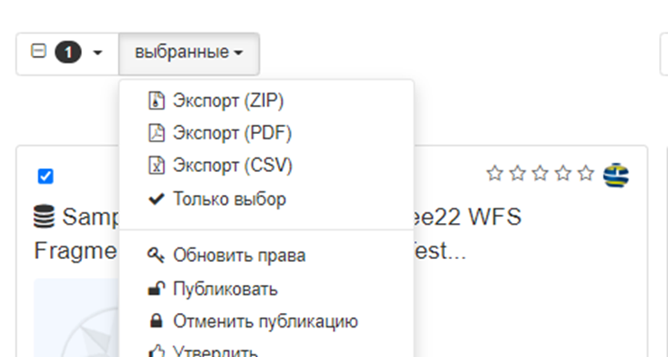

# Экспорт записей метаданных {#export}

В GeoNetwork есть 3 основных варианта экспорта метаданных: 
- В виде ZIP-архива 
- В виде файла CSV
- В виде PDF-файла

Экспортировать метаданные можно из результатов поиска или консоли редактора из меню "действия при выборе", как показано в следующем примере:



## Экспорт в виде ZIP-архива

Когда выбранный набор записей метаданных экспортируется в виде ZIP-архива, каждая запись метаданных вставляется в ZIP-архив в виде директории. 
В директории содержаться метаданные, зависимости метаданных и их логотипы (миниатюры). 
Этот тип ZIP-архива представляет собой формат MEF (Metadata Exchange Format) версии 2.0. 
Более подробную информацию о MEF V2 вы можете найти в руководстве для разработчиков GeoNetwork.

## Экспорт в виде файла CSV

Когда выбранный набор записей метаданных экспортируется в виде файла CSV/TXT, для каждой записи метаданных выполняется следующий процесс:

- создаётся краткое описание элементов из каждой выбранной записи метаданных генерируется путем применения шаблона из схемы метаданных. Папкой по умолчанию для любой схемы является "GEONETWORK_DATA_DIR/config/schema_plugins/`. В частности, для iso19115-3.2018 он находится здесь: "GEONETWORK_DATA_DIR/config/schema_plugins/iso19115-3.2018/layout/tpl-csv.xsl".
- извлекаются элементы, общие для всех элементов в кратком описании для всех записей метаданных (поскольку они могут отличаться в зависимости от схемы метаданных)
- создается запись заголовка с именами элементов, разделенными запятыми
- содержимое каждого элемента отображается в виде, разделенном запятыми. Если в кратком элементе содержится более одного дочернего элемента (например, для geoBox) содержимое каждого дочернего элемента разделяется с помощью '###'.

Ниже показан пример записи метаданных ISO в формате CSV:

``` csv
"schema","uuid","id","title","metadatacreationdate","geoBox"
"iso19115-3.2018","27b5f8b8-053a-11ea-aa46-02000a08f492","1312","S2A_MSIL1C_20161218T102432_N0204_R065_T32TMS_20161218T102606","2019-11-12T10:49:52,"7.691141905380134###9.128266945124432###45.958258688896564###46.95363733424615"
```

Можно переопределить краткое описание элементов метаданных, создав специальный шаблон в XSLT-формате для схемы метаданных. В качестве примера, можно переопределить краткое описание схемы iso 19115-3.2018 и заменить его другой полезной информацией.

В случае стандарта iso 19115-3.2018 необходимо изменить два файла:

1. geonetwork/WEB-INF/data/config/schema_plugins/iso 19115-3.2018/макет/tpl-csv.xsl
2. geonetwork/xslt/services/csv/csv-search.xsl

Например, для экспорта следующих элементов:

``` csv
"uuid","title","cloud_coverage_percentage","category","date-creation"
```

В первом файле нужно сделать следующее:

-   закомментировать идентификатор элемента (id), заголовок (title), аннотацию (abstract), кроме

    ``` xml
    <uuid>
          <xsl:value-of select="gn:info/uuid"/>
    </uuid>
    ```

-   чтобы добавить аналогичную строку между элементами аннотации и категории:

    ``` xml
    <myfield>myfieldvalue</myfield>
    ```

    Например:

    ``` xml
    <title>
       <xsl:copy-of select="mdb:identificationInfo/*/mri:citation/*/cit:title"/>
    </title>
    <cloud_coverage_percentage>
       <xsl:copy-of select="mdb:contentInfo/mrc:MD_ImageDescription/mrc:cloudCoverPercentage/gco:Real"/>
    </cloud_coverage_percentage>
    <category>
      <xsl:value-of select="mdb:metadataScope/*/mdb:resourceScope/*/@codeListValue"/>
    </category>
    ```

Что касается процента облачного покрытия (cloud_coverage_percentage), необходимо добавить пространство имен, если оно отсутствует:

``` xml
xmlns:mrc="http://standards.iso.org/iso/19115/-3/mrc/2.0"
```

Нужно прокомментировать все остальные строки, если не интересует другая информация, кроме:

``` xml
<xsl:copy-of select="gn:info"/>
```

так как она используется для сортировки результатов по схеме.

Во втором файле, *csv-search.xsl*, чтобы избежать автоматической печати трех столбцов:

``` csv
"schema","uuid","id",
```

стоит закомментировать следующие строки:

``` xml
<xsl:text>"schema"</xsl:text>
<xsl:value-of select="$sep"/>
<xsl:text>"uuid"</xsl:text>
<xsl:value-of select="$sep"/>
<xsl:text>"id"</xsl:text>
<xsl:value-of select="$sep"/>
```

и

``` xml
<xsl:value-of select="concat('&quot;', $metadata/geonet:info/schema, '&quot;', $sep,
'&quot;', $metadata/geonet:info/uuid, '&quot;', $sep,
'&quot;', $metadata/geonet:info/id, '&quot;', $sep)"/>
```

Эти изменения приведут к желаемому результату:

``` csv
"uuid","title","cloud_coverage_percentage","category","date-creation"
"c94da70e-066e-11ea-aa22-02000a08f492","S2A_MSIL1C_20180320T101021_N0206_R022_T33TUM_20180320T122057","36.0368","dataset","2018-03-20T12:20:57",
```
