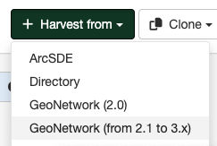

# Сбор метаданных из каталогов GeoNetwork версий 2.1-3.X

Для осуществления сбора записей метаданных из каталогов GeoNetwork версий 2.1-3.X реализован отдельный сборщик - он подключается к удалённому серверу GeoNetwork, и получает записи метаданных, соответствующие параметрам запроса.

# Создание сборщика 

Переход к созданию сборщика метаданных из базы данных осуществляется через вариант `Сбор данных` панели `Администрирование`. В открывшемся окне в источнике `Сбор из` следует выбрать опцию `GeoNetwork (from 2.1 to 3.x)`.
Необходимо заполнить панели конфигурации, как описано ниже:

Далее Пользователь в окне выполняет следующие действия.

### Идентификация сборщика данных

Пользователь идентифицирует сборщик данных:
	
- Назначает уникальные *Имя* и *логотип* сборщика. 
Следует указывать короткое, описательное имя для удалённого сервера GeoNetwork, из которого планируется сбор метаданных. Это имя будет отображаться на главной странице, как имя для этого сборщика.

> Примечание:
> Назначение логотипа является опциональным действием.
	
- Указывает *Группу*, которой будут принадлежать собранные записи метаданных. Только администратор пользователей этой группы может управлять сборщиком данных.
	
- Выбирает *Пользователя*, которому будут принадлежать собранные записи.

### Планирование расписания сбора данных 

Если расписание отключено, то сборщик данных должен запускаться со страницы сборщиков каталога метаданных вручную. Если расписание включено, то его необходимо настроить, используя встроенный планировщик или выражения синтаксиса cron (примеры можно найти [здесь](https://quartz-scheduler.org/documentation/quartz-2.1.7/tutorials/crontrigger)). 

### Настройка подключения к каталогу GeoNetwork

Указываются следующие данные:

- *Полный URL-адрес* удалённого сервера GeoNetwork 4.x. Адрес сервера должен включать имя каталога (например, http://fao.org/geonetwork).
- *Имя узла* каталога для сбора метаданных (обычно указывается srv).
- *Фильтр поиска* для ограничения собранных метаданных с помощью следующих критериев:
	* *Полный текст*: метаданные должны соответствовать всем текстовым полям.
	* *Заголовок*: сбор метаданных с указанным заголовком.
	* *Аннотация*: фильтрация по аннотациям записей метаданных.
	* *Ключевое слово*: сбор записей с указанным ключевым словом.
	* *Категории*: фильтр по категориям метаданных.
	* *Стандарт метаданных*: фильтр по стандартам метаданных.
	
	> Примечание:
	> Пользователь может указать фильтрацию по нескольким категориям или стандартам метаданных с помощью операторов `AND` или `OR`. Например, для объединения фильтров по категориям cat1 и cat2 нужно указать `cat1 AND cat2`. Или в случае выбора одного из двух стандартов следует задать `iso19139 OR iso19115-3.2018`.
	
	* *Группы*: фильтрация по группам каталога.
	
	> Примечание:
	> Пользователь может указать одну или несколько групп (владельцев метаданных) числовыми идентификаторами, разделенными запятыми.
	
- *Каталог*: для определения исходного подкаталога, если это необходимо.

### Обработка ответа 

Позволяет настроить некоторые действия над собираемыми метаданными:

- *Действие при инцидентах с UUID*: подразумевается задание действия в случае, если сборщик находит аналогичный UUID (уникальный идентификатор) записи, собранной иным способом - другим сборщиком, при помощи импорта записи, через панель редактора и др.
	
	* *Пропустить запись*, т.е. оставить дубликаты без изменений.
	* *Перезаписать запись*, т.е. заменить новой записью.
	* *Создать новый UUID*, т.е. присвоить новый UUID и сохранить как новую, так и старую записи.
	
> Примечание:
> По умолчанию у сборщиков выбран вариант пропуска записи с идентичным UUID

- *Удалённая аутентификация* - настраивается, если требуются учётные данные для исходного каталога GeoNetwork.

- *Использование полного формата MEF*: активирует передачу всех полей метаданных и ресурсов.

- *Использование даты изменений для сравнения*: сбор записи будет осуществляться только в случае, если дата изменения отличается.

- *Установить категорию метаданных, если она существует локально*: собранным метаданным присваивается категория, если она такая же категория была создана в группе, куда данные собираются.

- *Категория собранных метаданных*: устанавливается категория "по умолчанию" для собираемых метаданных.

- *Проверка записи перед импортом*. При включении данной функции, метаданные будут проверены (валидированы) на соответствие ожидаемой схеме метаданных перед импортом из каталога GeoNetwork и, если проверка не пройдена, то сбор записи метаданных будет пропущен.

- Задание *Имени XSL-фильтра для применения* к каждой записи метаданных: указываются пользовательские XSL-преобразования, если это необходимо. XSL-фильтр - это процесс, который зависит от схемы метаданных (см. папку `process` в схемах метаданных). XSL-фильтр может состоять из параметров, которые будут отправлены в XSL-преобразование с использованием следующего синтаксиса:
	
`anonymizer?protocol=MYLOCALNETWORK:FILEPATH&email=gis@organization.org&thesaurus=MYORGONLYTHESAURUS`

### Привилегии

Задаются привилегии для просмотра, редактирования или публикации собранных записей метаданных в Каталоге метаданных.