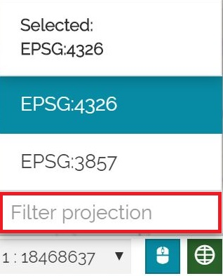

# Нижний колонтитул

********

Некоторая информация о карте отображается в *Нижнем колонтитуле*. По умолчанию, как только пользователь открывает карту, отображаются масштабная линейка и переключатель масштаба, чтобы пользователь мог изменять масштаб карты путем приближения/отдаления или выбора масштаба через переключатель.

Чтобы отобразить координаты карты, соответствующие указателю мыши в выбранной *Системе Координат* карты, пользователь может нажать на кнопку 

## Селектор СК

Также можно изменить *Систему Координат* карты, нажав на кнопку **Выбрать проекцию** . Откроется селектор СК для выбора одной из доступных СК, как показано ниже:

<video class="ms-docimage" controls><source src="img/footer/CRS_selector.mp4" /></video>

Для поиска нужной СК пользователь также может отфильтровать список СК, введя текст в поле поиска.

