# Панели инструментов окна просмотра карты

Основные панели инструментов, используемые пользователем для взаимодействия с окном просмотра карты:

* **Поисковая панель**

* **Боковая панель инструментов**

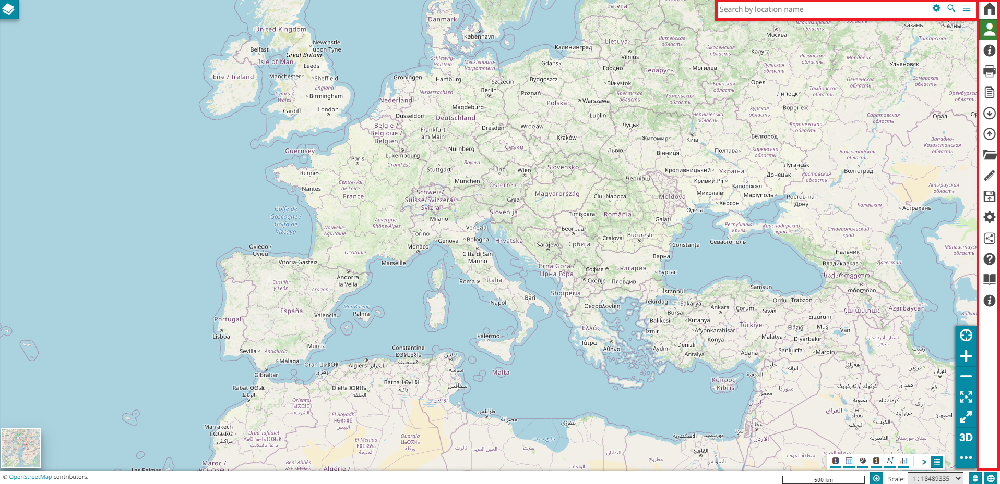

## Поисковая панель

Поисковая панель или **строка поиска** — это инструмент, который позволяет пользователю запрашивать слои для нахождения определенной информации. Поиск можно выполнять четырьмя различными способами:

* По **названию местоположения**

* По **координатам**

* Путем **настройки службы поиска**

* По **закладкам**

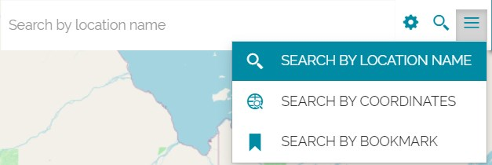

### Поиск по названию местоположения

*Поиск по названию местоположения*, установленный по умолчанию при создании новой карты, позволяет пользователю искать места, запрашивая [поисковый движок OpenStreetMap Nominatim](https://nominatim.openstreetmap.org/). При вводе желаемого места запрашивается поисковый движок Nominatim; затем, выбрав нужную запись в списке результатов, карта автоматически перецентрируется/масштабируется до выбранной области, которая также подсвечивается:

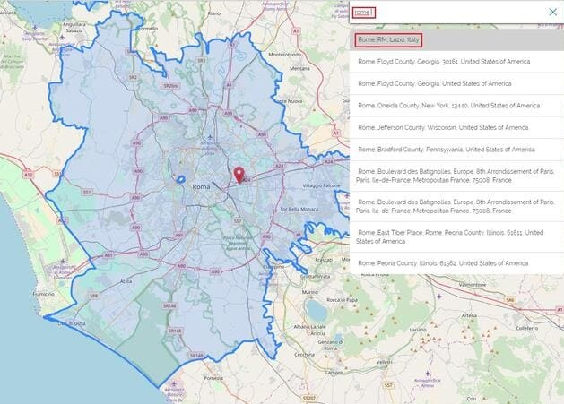

### Поиск по координатам

Выполняя *поиск по координатам*, пользователь может приблизиться к определенной точке и разместить в ее положении маркер. Эту точку можно указать, введя координаты в двух разных форматах:

* **Десятичный** (формат по умолчанию)

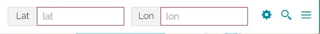

* **Аэронавигационный** (который можно выбрать с помощью кнопки )

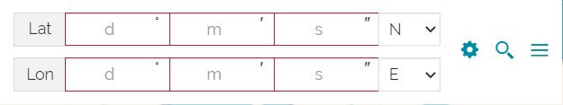

После установки координат можно выполнить поиск с помощью кнопки . Отображаемый результат будет выглядеть примерно так:

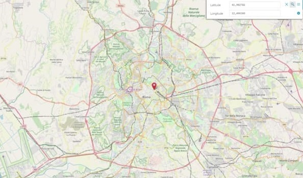

### Настройка службы поиска

Пользователю также предоставляется возможность расширить или заменить результаты OSM по умолчанию дополнительными *службами поиска WFS*. Выбрав опцию **Настроить службы поиска** , открывается следующее окно:

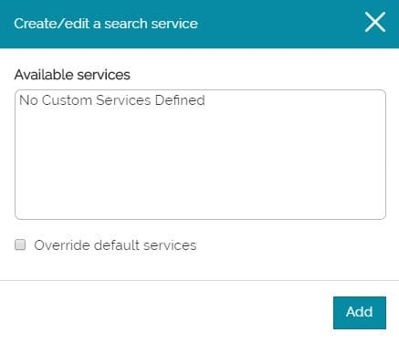

Чтобы создать новую пользовательскую службу, кнопка  переводит пользователя на страницу, где он может установить *свойства службы WFS*, например:

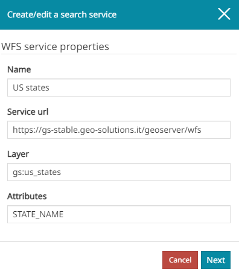

В частности, необходимо ввести следующую информацию:

* **Название** службы

* **URL службы** WFS, которую пользователь хочет вызвать

* **Слой** для запроса

* Конкретные **атрибуты** (поля, разделенные запятыми), по которым пользователь хочет выполнить запрос

Когда все опции установлены, нажатие на кнопку  открывает новую панель, где можно выбрать свойства для отображаемых результатов:

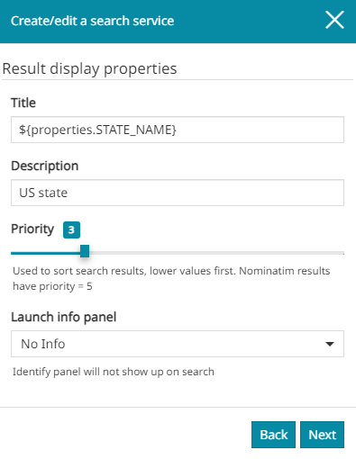

В этом случае пользователь может определить следующие настройки:

* **Заголовок**, отображаемый вверху каждой строки результатов (на предыдущем изображении, например, выбранный заголовок для результатов соответствует атрибуту NAME объекта)

* **Описание**, которое будет отображаться в результатах сразу под заголовком

* **Приоритет** — параметр, определяющий положение записей в списке результатов. Более низкие значения означают более высокие позиции в списке результатов, и наоборот. По умолчанию результат [поискового движка OpenStreetMap Nominatim](https://nominatim.openstreetmap.org/) имеет приоритет, равный 5, поэтому, чтобы видеть пользовательские результаты на более высокой позиции, необходимо установить более низкое значение приоритета.

* **Запуск информационной панели** позволяет пользователю выбрать, будет ли и как пользовательский поиск взаимодействовать с [инструментом "Идентификация"](navigation-toolbar.md#инструмент-идентификация). В частности, при выборе опции *Нет информации* информационная панель не появляется после выбора записи из результатов поиска. При выборе *Все слои* или *Один слой* запускается инструмент "Идентификация", и открывается соответствующая панель с информацией обо всех/одном слое, видимом на карте. При выборе *Один слой* инструмент "Идентификация" запускается только для слоя (если он присутствует и видим на карте), связанного с выбранной записью в списке результатов поиска.

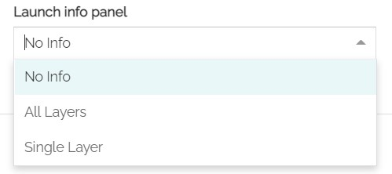

!!! note "Примечание"
    Обратите внимание, что при выборе опций *Все слои* или *Один слой* точка, используемая для запроса идентификации, является точкой, принадлежащей поверхности геометрии выбранной записи. Кроме того, при использовании *Один слой* запрос идентификации будет фильтровать результаты по выбранной записи и ее слою, используя `featureid`, который может быть проигнорирован другими серверами, но может быть использован GeoServer для выбора конкретного объекта из результатов, когда info_format отличается от *application/json*. Чтобы обеспечить фильтрацию объектов на серверах, отличных от GeoServer, можно выбрать формат (*info_format*) как *application/json* для слоя, чтобы **GetFeatureInfo** из настроек слоя в Панели содержания мог фильтровать объекты по ID выбранной записи.

После установки всех опций можно перейти дальше с помощью кнопки "Далее" , которая открывает панель *Необязательные свойства*:

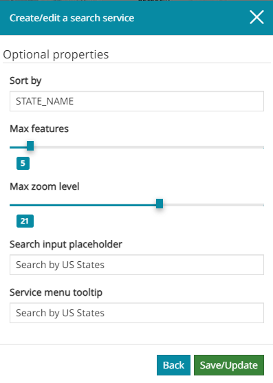

Здесь пользователь может выбрать:

* **Сортировать** результаты **по** указанному атрибуту

* **Максимальное** количество **объектов** (элементов), отображаемых в результатах пользовательского поиска

* **Максимальный** уровень **масштаба**, который будет установлен для карты при открытии из результата пользовательского поиска

* Текст, который будет вставлен в качестве **плейсхолдера** в **поле ввода поиска**, когда служба поиска выбрана в *Меню служб*

* Текст, который будет вставлен в качестве **подсказки** в **Меню служб**, видимый при наведении мыши на службу поиска

После нажатия кнопки  можно увидеть пользовательскую службу поиска WFS в списке *Доступные службы*:

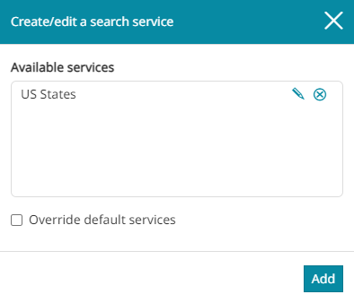

После создания службы поиска всегда можно отредактировать ее  или удалить  из списка. По умолчанию опция **Переопределить службы по умолчанию** отключена, в этом случае при выполнении поиска отображаются не только результаты пользовательской службы поиска, но и результаты Nominatim:

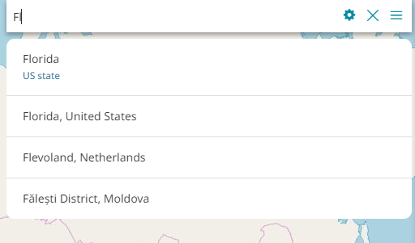

Если опция **Переопределить службы по умолчанию** включена, отображаются только результаты пользовательской службы поиска:

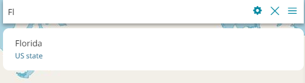

Если определено несколько служб поиска, по умолчанию поиск выполняется по всем из них в соответствии с приоритетом, настроенным для каждой службы (см. выше). Поэтому пользователь также может выбрать нужную службу поиска из меню, чтобы выполнить поиск только по ней. Выбрав кнопку **Меню служб поиска** , открывается следующее окно:

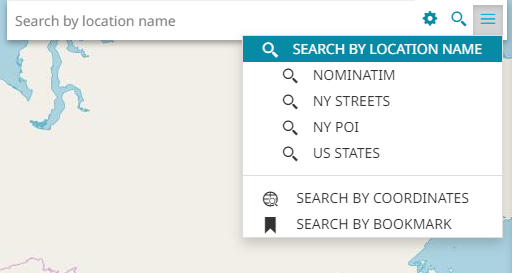

В *Меню поиска* пользователь может выбрать одну из служб поиска для выполнения поиска, щелкнув по одной из них. Пример может быть следующим:

<video class="ms-docimage" style="max-width:600px;" controls><source src="img/menu-bar/search-with-one-search-service.mp4"/></video>

### Поиск по закладкам

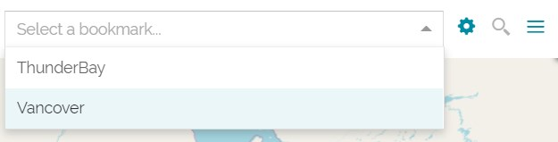

Приложение позволяет пользователю выполнять поиск по предварительно настроенным закладкам, которые могут приближать к определенной области ограничивающего прямоугольника или приближать с одновременной перезагрузкой видимости слоев. Выбрав значок **Настройки закладок** , открывается следующее окно:

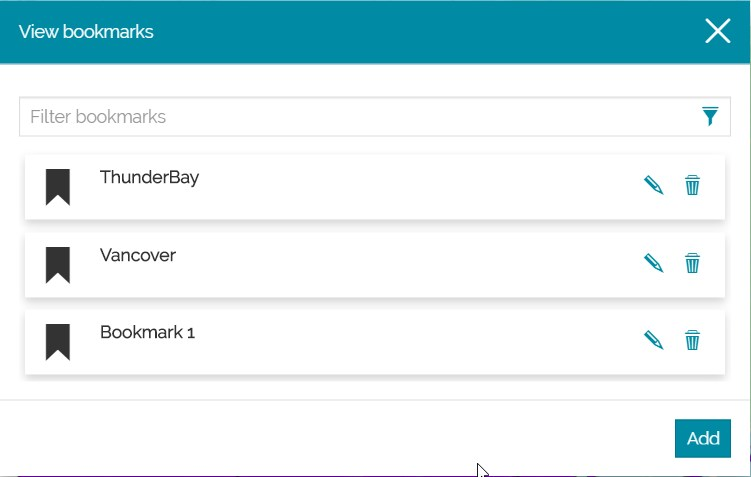

Чтобы создать новую закладку, кнопка  открывает страницу **Добавить новую закладку**, где пользователь устанавливает *свойства закладки*, например:

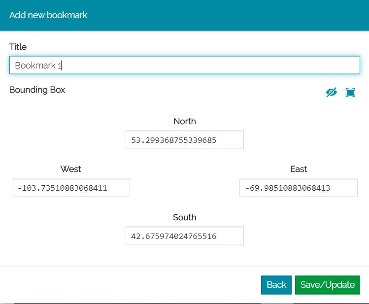

В частности, необходимо ввести следующую информацию:

* **Заголовок** закладки

* Свойство **Ограничивающий прямоугольник**, к которому пользователь хочет приблизиться

  * **Запад**, **Юг**, **Восток** и **Север**

* **Переключить перезагрузку видимости слоев**,  для включения/отключения перезагрузки видимости слоев при поиске по закладке

Примечание: Пользователь может определить значение ограничивающего прямоугольника либо вручную, либо выбрав **Использовать текущий вид как ограничивающий прямоугольник** 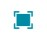, чтобы получить текущие значения ограничивающего прямоугольника из вида карты и заполнить поля.

Когда все свойства установлены, выбрав , можно увидеть новую добавленную закладку в списке **Просмотр закладок**:

После создания закладки всегда можно *Отредактировать* ее  или *Удалить*  из списка.

## Боковая панель инструментов

*Боковая панель инструментов* — это важный компонент, расположенный с правой стороны окна просмотра карты, который предоставляет пользователю доступ к различным инструментам. По умолчанию доступны следующие инструменты:

В частности, с помощью этих опций можно:

* [Распечатать](print.md) карту, нажав кнопку 

* **Экспортировать карту** в формате `json`, нажав кнопку 

* [Импортировать](import.md) файлы с вашего компьютера, нажав кнопку 

* Открыть [Каталог](catalog.md) для подключения к удаленной службе и добавления слоев на карту, нажав кнопку 

* Выполнить [Измерение](measure.md) на карте, нажав кнопку 

* **Сохранить** карту, нажав кнопку , чтобы применить изменения, сделанные в существующей карте. При выборе этой опции открывается окно, уже заполненное текущими свойствами карты.

* **Сохранить как**, когда пользователю необходимо сохранить копию карты или сохранить ее в первый раз, нажав кнопку 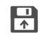. При выборе этой опции открывается пустое окно свойств карты.

* **Удалить карту**, чтобы удалить текущую карту, нажав кнопку 

* Получить доступ к **Настройкам** карты, нажав кнопку , где пользователь может изменить текущий **Язык** и выбрать опции [Идентификации](navigation-toolbar.md#инструмент-идентификация)

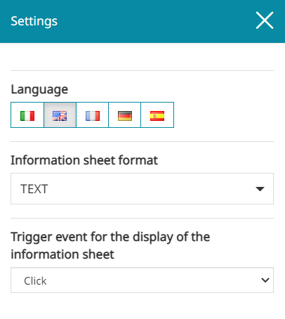

!!! note "Примечание"
    Когда включена [3D-навигация](navigation-toolbar.md#3d-навигация), при открытии панели **Настройки** редактор может настроить некоторые опции, связанные с *просмотрщиком Cesium*.
    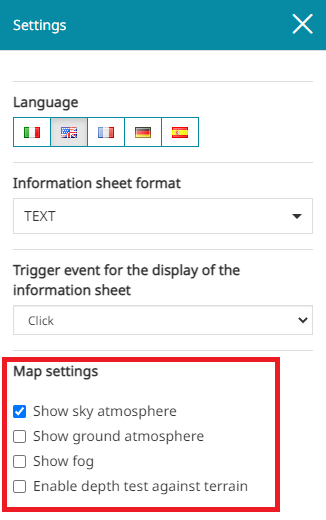

    В частности, в *Настройках карты* можно:

    * Включить **Показывать атмосферу неба**, чтобы видеть атмосферу вокруг глобуса

    * Включить **Показывать приземную атмосферу**, чтобы видеть приземную атмосферу на глобусе, когда камера находится далеко

    * Включить **Показывать туман**, чтобы повысить производительность за счет рендеринга меньшего количества геометрии и отправки меньшего количества запросов рельефа

    * Включить **Проверку глубины относительно рельефа**, если примитивы, такие как значки, полилинии, метки и т.д., должны проверяться на глубину относительно поверхности рельефа, а не всегда рисоваться поверх рельефа, если только они не находятся на противоположной стороне глобуса

* Просмотреть панель **Об этой карте**, нажав кнопку , когда подробности о карте присутствуют

* Начать **Обучение**, нажав кнопку 

* Узнать больше информации **О приложении** и развернутой **Версии**, нажав кнопку 

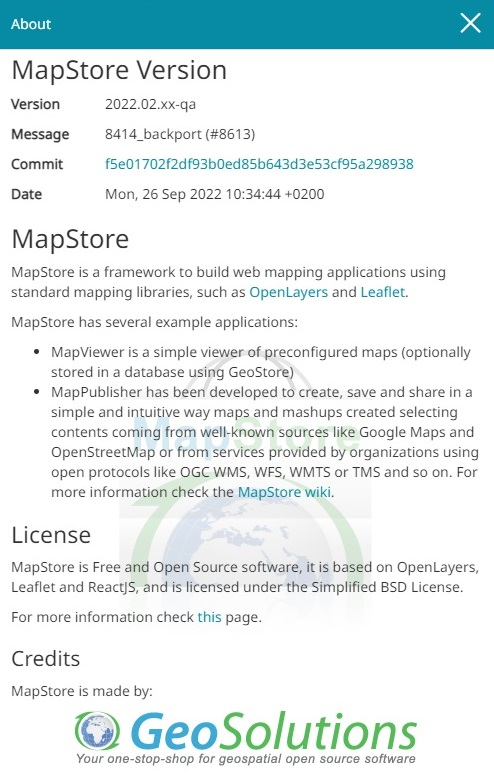

!!! info "Внимание"
    Кнопки **Сохранить**, **Удалить карту** и **Поделиться** присутствуют в *Меню опций* только тогда, когда карта уже была сохранена хотя бы один раз.