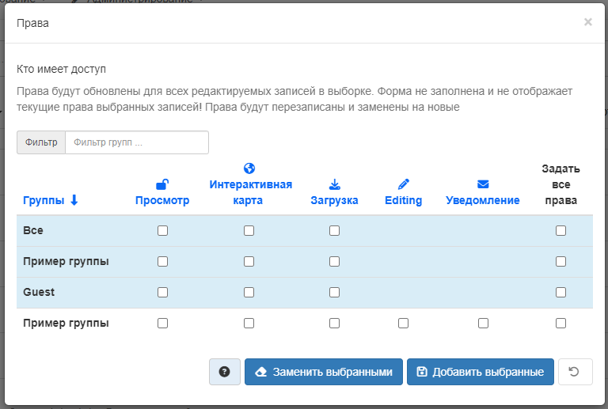

# Управление правами доступа

Чтобы управлять правами доступа для записей метаданных и любых прикрепленных данных, 
необходимо определить **группы пользователей** и **права доступа** пользователей в этих группах (просмотр метаданных, загрузка данных, прикрепленных к записи и т. д.).

Например, можно указать, что метаданные и связанные с ними службы видны всем пользователи интернета или только пользователям внутренней сети. 
Права доступа назначаются для каждой группы. В зависимости от профиля пользователя (Гость, Зарегистрированный пользователь, Редактор, Администратор и т. д.) 
будет различаться доступ к этим функциям.

## Назначение прав доступа

Чтобы назначить права доступа, нужно выполнить следующие действия:

1.  Найти запись метаданных в панели редактора. В строке каждой записи справа располагается кнопка `Права`. Также в режиме просмотра записи можно нажать `Управление записью` - `Права`.
2.  Нажав кнопку `Права`, появится выпадающее меню. С помощью флажков можно назначить определенные права доступа конкретным группам пользователей.
3.  Кнопки «Установить все» и «Снять все» позволяют устанавливать и снимать флажки одновременно.

Ниже приведено краткое описание прав доступа, чтобы определить, какие из них следует назначить той или иной группе (группам).

- **Просмотр**: Пользователи из указанной группы/групп могут просматривать метаданные, например, если они соответствуют критериям поиска, введенным таким пользователем.

- **Загрузка**: Пользователи из указанной группы/групп могут загрузить данные.

- **Интерактивная карта**: Пользователи указанной группы/групп могут получить интерактивную карту. Интерактивная карта должна быть создана отдельно с помощью сервера веб-карт, например GeoServer, который распространяется вместе с GeoNetwork.

- **Редактирование**: При случайном выборе GeoNetwork запись метаданных может появиться в разделе `Избранное` на главной странице GeoNetwork.

- **Уведомление**: Пользователи в указанной группе получают уведомление о загрузке данных, прикрепленных к записи метаданных.

Прежде чем начинать настройку прав доступа стоит ознакомиться с разделом [Пользователи, группы и роли](../../administrator-guide/managing-users-and-groups/index.md#user_profiles) в разделе «Администрирование пользователей и групп» данного руководства.

!!! Примечание

    Общедоступная запись метаданных - это запись метаданных, которая имеет права доступа просмотра для группы с именем «Все».

К разрешениям на просмотр и редактирование записи метаданных применяются следующие правила:

## Просмотр

*Администратор* может просматривать любые метаданные.

*Рецензент* может просматривать метаданные, если:

- Метаданные являются общедоступными или
- Метаданные входят в группу пользователь, членом которой является рецензент.

*Пользователь-администратор* и *редактор* могут просматривать:

- Все метаданные, для которых выбрана привилегия просмотра в одной из групп, в которых они состоят.
- Все метаданные, созданные ими.

*Зарегистрированный пользователь* может просматривать:

- Все метаданные, для которых выбрана привилегия просмотра в одной из групп, в которых они состоят.

Любой пользователь (вошедший в систему или нет) может просматривать общедоступные метаданные.

## Редактирование

*Администратор* может редактировать любые метаданные.

*Рецензент* может редактировать метаданные, если:

- Владелец метаданных является членом одной из групп, назначенных рецензенту.
- Он являются владельцами метаданных.

*Пользователь-администратор* или *Редактор* может редактировать только созданные им метаданные.

# Установка привилегий

## Установка привилегий для записи метаданных

Кнопка для доступа к странице прав доступа для записи метаданных отображается в результатах поиска или при просмотре записи:

- Всех администраторов
- Всех рецензентов, которые являются членами одной из групп, назначенных владельцу метаданных.
- Владелец метаданных

Только администраторы и рецензенты могут редактировать привилегии для групп "Все" и "Внутренняя сеть".

## Установка прав доступа для выбранного набора записей метаданных

Можно установить привилегии для выбранного набора записей в результатах поиска с помощью меню «действия над выбранным набором».

Применяются следующие правила:

- группы — это те группы, к которым принадлежит пользователь
- указанные привилегии будут применены только к записям, на которые у пользователя есть права владения или администрирования - любые другие записи будут пропущены
- текущие права доступа записей будут сброшены и заменены выбранной привилегией
