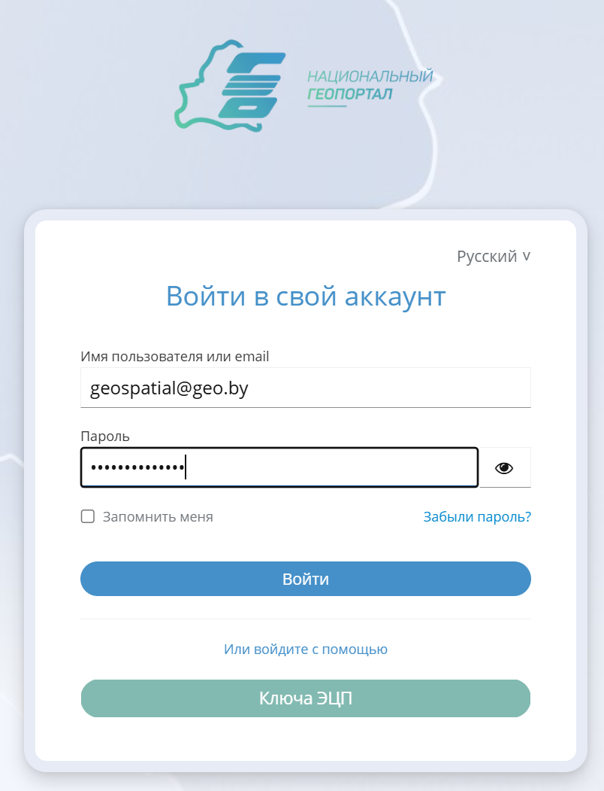
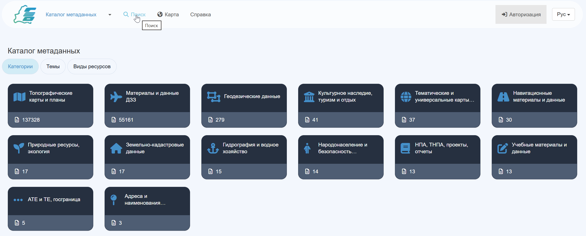

# Быстрый старт {#quick_start}

В качестве программной основы Каталога метаданных Национального геопортала выступает GeoNetwork - это приложение, предназначенное для управления пространственно привязанными ресурсами. Оно предоставляет пользователям Национального геопортала широкий функционал для поиска и редактирования метаданных. 

!!! Внимание Внимание
    В этой статье не описывается весь возможный функционал GeoNetwork. Для полного погружения в возможности GeoNetwork рекомендуем Вам полностью ознакомиться со [*справочной документацией Каталога метаданных*](https://nipd.by/geonetwork/doc/index.html).

Переход в Каталог метаданных доступен по ссылке - [Каталог метаданных](https://nipd.by/geonetwork). Рекомендуем открыть Каталог метаданных в соседней вкладке Вашего веб-браузера и ознакомиться с первоначальными действиями в Каталоге, описанными в этой статье.

## Вход в Каталог метаданных

Для авторизации в Каталоге метаданных нажмите кнопку нажмите кнопку **Авторизация**, расположенную в правом верхнем углу интерфейса:

Откроется страница ввода данных авторизации, заполнив которые в соответствующие поля, нажмите **Войти**. 

Также возможен вход с использованием ключа *Электронной цифровой подписи*: для данного вида авторизации подготовьте настроенное программное обеспечение и сам цифровой ключ, а также при появлении диалогового окна будьте готовы ввести пароль доступа.

!!! Внимание Внимание
    Если Вы забыли или утеряли пароль от своей учётной записи, нажмите кнопку  и на адрес электронной почты, указанный при регистрации (или указанный администратором Вашего субпортала), будет направлено автоматическое письмо со ссылкой на сброс пароля.

## Способы поиска пространственных данных

Для того, чтобы осуществить поиск записей (в режиме полнотекстового поиска или поиска по виду/категории/автору данных) в Каталоге метаданных или его субпорталах, нажмите на кнопку **Поиск**.

**Cпособы осуществления поиска метаданных и их фильтрации** в Каталоге метаданных с примерами подробно описаны в соответствующей статье справочной документации - [Страница поиска](../../help/search/index.md).

## Использование картографического приложения Каталога

Каталог метаданных позволяет даже незарегистрированным пользователям открывать для просмотра веб-карты обязательных наборов пространственных данных с использованием *картографического приложения* - просмотр доступен по нажатию кнопки **Карта**.

Интерфейс картографического приложения подробно описан в соответствующем разделе справочной документации - [Страница карты](../../help/map/index.md).

## Просмотр и создание записей метаданных в Каталоге

Неавторизованные пользователи могут просмотривать опубликованные для всеобщего доступа записи в своих субпортала и в Каталоге метаданных. Возможности по просмотру записей (настройка вида просмотра, экспорт метаданных и т.д.) описаны в соответствующей статье - [Просмотр записи](../../help/record/index.md).

Авторизованные пользователи могут создавать записи метаданных в своих электронных кабинетах. Для ознакомления с порядком создания записей, управления шаблонами, импорта метаданных Вам следует изучить раздел [Работа с записями метаданных](../describing-information/index.md) справочной документации.