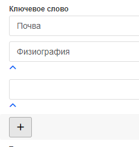

# Классификация по ключевым словам

Для записи метаданных также можно задать **ключевые слова**, которые помогают кратко описать ресурс.
В режиме редактирования нажмите `Добавить новые ключевые слова`. При создании ключевого слова нужно заполнить 2 поля:
- Название ключевого слова
- Тип ключевого слова. По умолчанию можно выбрать следующие типы: временной, место, область знаний, слой, тема

