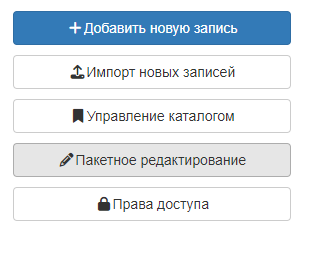
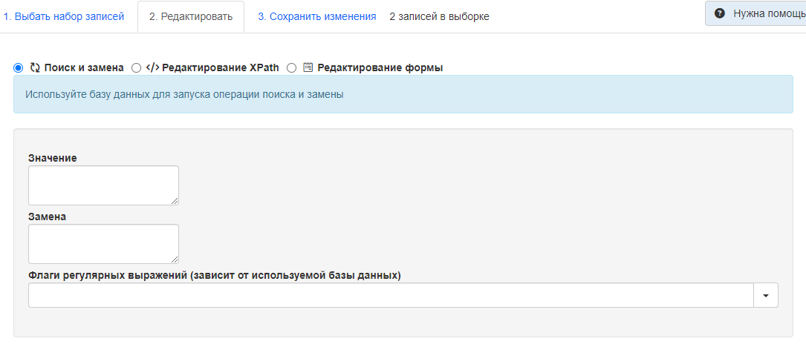
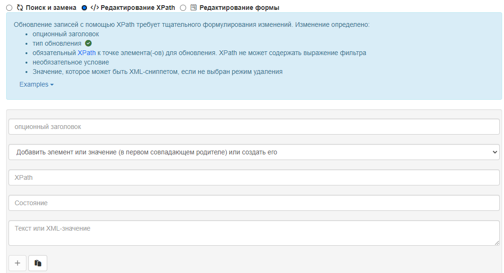
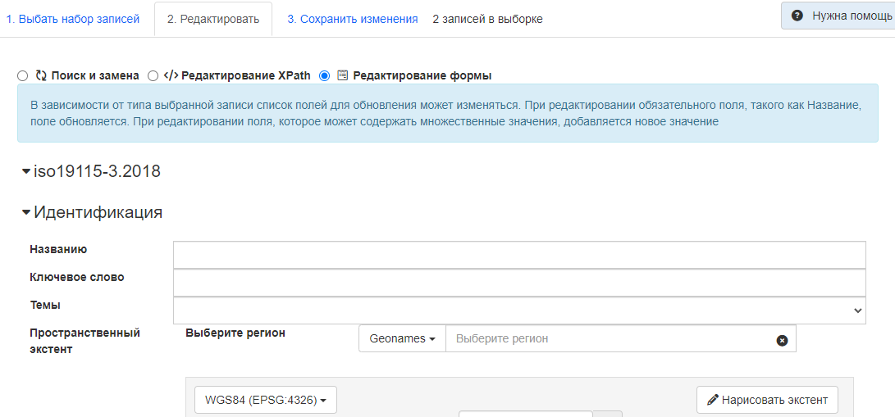
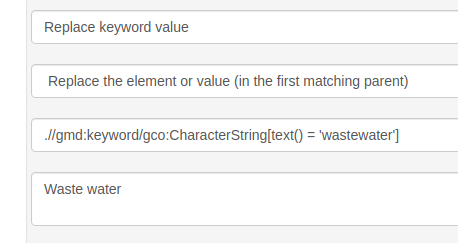
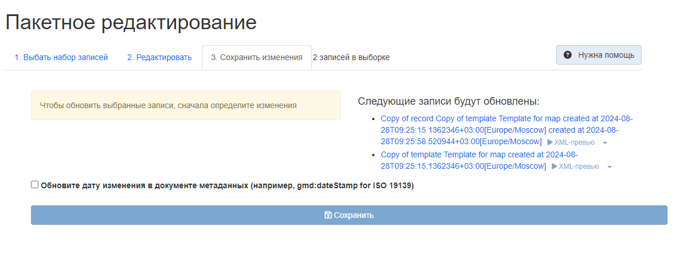

# Пакетное редактирование из консоли редактора {#batchediting}

Из панели редактора можно открыть окно пакетного редактирования (одновременное редактирование нескольких записей), 
где выполняется редактирование набора записей метаданных (`Редактирование`-`Панель редактора`-`Пакетное редактирование`). 



Пакетное редактирование записей состоит из 3 этапов:

- Выбор набора записей (`Выбрать набор записей`)
- Определение типа правок (`Редактировать`)
- Применение правок (`Сохранить изменения`)

## Определение правок

!!! warning "Предупреждение"
    Неправильное определение правок может испортить сразу несколько записей. Рекомендуется сделать резервную копию всех записей.

Определить правки можно 3-мя способами:

-  Поиск и замена
-  Редактирование XPath (язык запросов к элементам XML-документа)
-  Редактирование формы

## Поиск и замена

Имеет следующие поля:
- `Значение` - элемент, который должен быть заменён 
- `Замена` - элемент, на который должно быть заменено `Значение`
- `Флаги регулярных выражений` - условия, при которых должна произойти замена



## Редактирование XPath

Доступен расширенный режим для определения пользовательских правок, редактируя XML-документ напрямую. Расширенный режим состоит из:

  - необязательного названия
  - тип обновления (`gn_add`-`Добавить или создать элемент`, `gn_replace`-`Заменить элемент`, `gn_delete`-`Удалить элемент`)
  - обязательного XPath, указывающего на элемент(ы) для обновления. XPath может содержать выражение фильтра.
  - значение, которое может быть фрагментом XML или текстовой строкой, если режим не `Удалить элемент`.



# Редактирование формы

Изменения определяются на основе каждого стандарта. Набор полей по умолчанию для редактирования доступен 
и может быть расширен в файле `config-editor.xml` стандарта.



Чтобы добавить элемент, например, добавить новый раздел с ключевым словом в первую позицию:

``` json
[{
  "xpath": "/gmd:identificationInfo/gmd:MD_DataIdentification/gmd:descriptiveKeywords[1]",
  "value": "<gn_add><gmd:descriptiveKeywords xmlns:gmd=\"http://www.isotc211.org/2005/gmd\" xmlns:gco=\"http://www.isotc211.org/2005/gco\"><gmd:MD_Keywords><gmd:keyword><gco:CharacterString>Waste water</gco:CharacterString></gmd:keyword><gmd:type><gmd:MD_KeywordTypeCode codeList=\"./resources/codeList.xml#MD_KeywordTypeCode\" codeListValue=\"theme\"/></gmd:type></gmd:MD_Keywords></gmd:descriptiveKeywords></gn_add>"
}]
```

Удалить элемент, например, удалить все онлайн-ресурсы, имеющие протокол `OGC:WMS`::

``` json
[{
  "xpath": ".//gmd:onLine[*/gmd:protocol/*/text() = 'OGC:WMS']",
  "value":"<gn_delete></gn_delete>"
}]
```

Замена элемента, например, замена значения ключевого слова:

``` json
[{
  "xpath":".//gmd:keyword/gco:CharacterString[text() = 'wastewater']",
  "value":"<gn_replace>Waste water</gn_replace>"
}]
```



## Применение изменений

При применении изменений применяются привилегии пользователя, поэтому если пользователь не может редактировать выбранную запись, 
пакетное редактирование не будет применено к этой записи.

Отчет о пакетном редактировании показывает, сколько записей было обработано:



Пакетное редактирование также может быть применено с помощью API: ``doc/api/index.html#/records/batchEdit>``.

## Примеры

### Добавление новых ключевых слов

- Режим: Добавить элемент

- XPath (родительский элемент фрагмента XML для добавления). XML вставляется в позицию, определенную в XSD.

    ``` xslt
    .//srv:SV_ServiceIdentification
    ```

-   XML

    ``` xml
    <mri:descriptiveKeywords xmlns:mri="http://standards.iso.org/iso/19115/-3/mri/1.0"
                             xmlns:gcx="http://standards.iso.org/iso/19115/-3/gcx/1.0"
                             xmlns:xlink="http://www.w3.org/1999/xlink">
      <mri:MD_Keywords>
        <mri:keyword>
          <gcx:Anchor xlink:href="http://inspire.ec.europa.eu/metadata-codelist/SpatialDataServiceCategory/infoMapAccessService">Service d’accès aux cartes</gcx:Anchor>
        </mri:keyword>
      </mri:MD_Keywords>
    </mri:descriptiveKeywords>
    ```

### Замена кодировки ключевого слова с CharacterString на якорь

- Режим: Заменить элемент

- XPath (родительский элемент фрагмента XML для вставки)

    ``` xslt
    .//mri:descriptiveKeywords[*/mri:keyword/gco:CharacterString/text() = 'infoMapAccessService']
    ```

-   XML

    ``` xml
    <mri:MD_Keywords  xmlns:cit="http://standards.iso.org/iso/19115/-3/cit/2.0"
                      xmlns:mri="http://standards.iso.org/iso/19115/-3/mri/1.0"
                      xmlns:mcc="http://standards.iso.org/iso/19115/-3/mcc/1.0"
                      xmlns:gco="http://standards.iso.org/iso/19115/-3/gco/1.0"
                      xmlns:gcx="http://standards.iso.org/iso/19115/-3/gcx/1.0"
                      xmlns:xlink="http://www.w3.org/1999/xlink">
      <mri:keyword>
        <gcx:Anchor xlink:href="http://inspire.ec.europa.eu/metadata-codelist/SpatialDataServiceCategory/infoMapAccessService">Service d’accès aux cartes</gcx:Anchor>
      </mri:keyword>
      <mri:type>
        <mri:MD_KeywordTypeCode codeList="http://standards.iso.org/iso/19115/resources/Codelists/cat/codelists.xml#MD_KeywordTypeCode"
                                 codeListValue="theme"/>
      </mri:type>
      <mri:thesaurusName>
         <cit:CI_Citation>
            <cit:title>
               <gcx:Anchor xlink:href="http://inspire.ec.europa.eu/metadata-codelist/SpatialDataServiceCategory#">Classification of spatial data services</gcx:Anchor>
            </cit:title>
            <cit:date>
               <cit:CI_Date>
                  <cit:date>
                     <gco:Date>2008-12-03</gco:Date>
                  </cit:date>
                  <cit:dateType>
                     <cit:CI_DateTypeCode codeList="http://standards.iso.org/iso/19115/resources/Codelists/cat/codelists.xml#CI_DateTypeCode"
                                          codeListValue="publication"/>
                  </cit:dateType>
               </cit:CI_Date>
            </cit:date>
            <cit:identifier>
               <mcc:MD_Identifier>
                  <mcc:code>
                     <gcx:Anchor xlink:href="http://metawal.wallonie.be/geonetwork/srv/fre/thesaurus.download?ref=external.theme.httpinspireeceuropaeumetadatacodelistSpatialDataServiceCategory-SpatialDataServiceCategory">geonetwork.thesaurus.external.theme.httpinspireeceuropaeumetadatacodelistSpatialDataServiceCategory-SpatialDataServiceCategory</gcx:Anchor>
                  </mcc:code>
               </mcc:MD_Identifier>
            </cit:identifier>
         </cit:CI_Citation>
      </mri:thesaurusName>
    </mri:MD_Keywords>
    ```

### Удаление XML-блока ключевого слова

- Режим: Удалить элемент

- XPath (родительский элемент фрагмента XML для вставки)

    ``` xslt
    (.//mri:descriptiveKeywords
        [*/mri:thesaurusName/*/cit:title/gcx:Anchor = 'Champ géographique'])[2]
    ```

-   XML (N/A)

### Удаление ключевого слова

- Режим: Удаление элемента

- XPath (родительский элемент фрагмента XML для вставки)

    ``` xslt
    .//gmd:keyword[*/text() = 'IDP_reference']
    ```

-   XML (N/A)

### Удалите associatedResource с типом partOfSeamlessDatabase, только если это серия

- Режим: Удаление элемента

- XPath (родительский элемент фрагмента XML для вставки)

    ``` xslt
    .[mdb:metadataScope/*/mdb:resourceScope/*/@codeListValue = 'series']//mri:associatedResource[*/mri:associationType/*/@codeListValue = "partOfSeamlessDatabase"]
    ```

-   XML (N/A)
