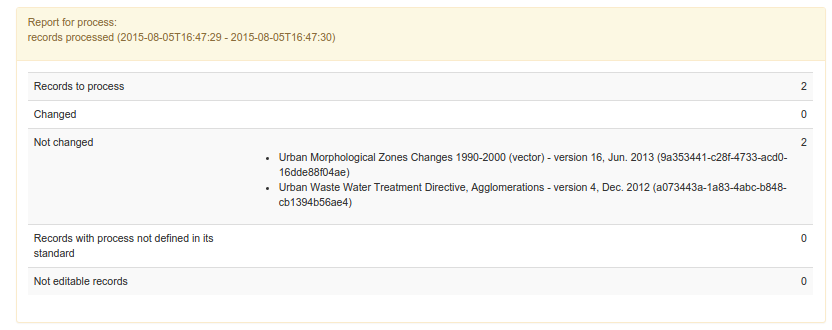

# Пакетное редактирование из консоли администратора {#batchupdate_from_admin}

Пользователи-администраторы могут из `консоли администратора` открыть страницу `инструменты`, `Пакетный процесс`.

На этой странице администратор может:

- Выбрать набор записей

    

- Выбрать процесс из списка

    

!!! См. также

    Можно добавить новый процесс. Смотрите [Добавление пакетного процесса](batchupdate-xsl.md#batch-process-add).


- Определить параметры процесса (если таковые имеются).
- Запустить процесс и следить за ходом выполнения.

Процесс может быть применен только к тем записям, которые текущий пользователь может редактировать. Если это не так, запись, для изменения которой пользователю не хватает привелегий, игнорируется и процесс продолжается. Отчет содержит следующую информацию:

- Количество записей, подлежащих обработке
- Количество записей, затронутых процессом
- Количество записей без изменений (для процесса поиска и замены)
- Количество записей, для которых процесс не был найден (процесс зависит от стандарта и может не существовать в зависимости от стандарта).
- Количество записей, которые текущий пользователь не может редактировать



Перед запуском процесса рекомендуется сделать резервную копию всех записей метаданных, подлежащих обновлению, на случай, если что-то пойдет не так в процессе.

!!! info «Todo»

    Документирование других процессов


## Поиск и замена

Этот процесс осуществляет поиск значений в элементах и замену их другими значениями. Он поддерживает записи ISO19139 и Dublin Core. Конфигурация выглядит следующим образом:


- Выберите пакет (ISO19139 или Dublin Core)
- Выберите элемент из этого пакета для замены (предварительно настроенным является элемент о контакте, но его можно расширить - см. ниже)
- Определите значение поиска
- Определите замену
- Нажмите кнопку `Добавить замену`.

Можно настроить и добавить несколько замен. После настройки пользователь может сохранить конфигурацию, нажав `Загрузить конфигурацию`. Конфигурация загружается в формате JSON и может быть обновлена и перезагружена позже путем копирования/вставки в текстовую область конфигурации замены и нажатия `Загрузить конфигурацию`.

Пример настройки:
``` json
[{
  "package":"iso19139",
  "element":"iso19139\\..*\\.individualName",
  "searchval":"John",
  "replaceval":"Pierre"
  }]
```

В конфигурации `Элемент` определяет целевой элемент в записи метаданных. Он начинается с идентификатора схемы, а затем определяет путь к элементу. Это регулярное выражение, которое может использовать `.*` для поиска всех элементов в документе. Чтобы найти более конкретный элемент, пользователь может определить полный путь, например `iso19139\\\.contact\\\.individualName`, чтобы найти только индивидуальное имя контакта в метаданных.

Значение `searchval` также представляет собой [регулярное выражение](https://www.regular-expressions.info/tutorial.html). Это может быть простой текст или более сложное выражение. Например, при отлове групп поиск по `(.*)` и замена на `Mr $1` заменит `John` на `Mr John`.

Последний параметр - это режим "вакуума", определяющий, что делать с пустыми элементами:


После завершения настройки пользователь может просмотреть изменения, нажав кнопку `Test`, а затем применить их с помощью `Run`.