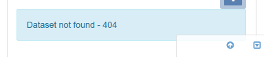

# Публикация ГИС-данных в картографическом сервере {#geopublication-usage}

В этом разделе описывается, как публиковать данные ГИС на картографическом сервере.

## Прежде чем начать

- Администратору каталога необходимо настроить подключение к картографическим серверам в интерфейсе администрирования (см. [Конфигурация картографических серверов для геопубликаций](../../administrator-guide/configuring-the-catalog/map-server-configuration.md)).
- Записи метаданных должны ссылаться на файлы ГИС или таблицы пространственных баз данных (см. [Связывание таблицы базы данных или файла ГИС в сети](../associating-resources/linking-online-resources.md#linking-online-resources-georesource)).

Чтобы опубликовать данные из редактора метаданных на удаленный картографический сервер, нужно выполнить следующие действия:

1.  Когда обнаружен пространственный ресурс и настроены один или несколько картографических серверов, в редакторе метаданных становится доступен окно для публикации геоданных.

    

2.  Из списка нужно выбрать **ресурс** для публикации. Откроется окно, где представлен список доступных картографических серверов:

    

3.  Дальше нужно выбрать **сервер**, на котором нужно опубликовать данные. После выбора каталог проверит, опубликовался ли набор данных.

    Если он опубликован, то добавляется на карту.

    

    Если нет, то в сообщении о состоянии указывается, что набор данных недоступен.

    

4.  Из меню можно управлять процессом публикации:

    

    - Кнопка `Проверка` - проверить опубликован ли уже набор данных на выбранном сервере.
    - Кнопка `Публикация` - зарегистрировать данные на выбранном картографическом сервере.
    - Кнопка `Не публиковать` - снять регистрацию данных на выбранном картографическом сервере.
    - Кнопка `Связать службу с метаданными` - добавить ссылки на службу OGC в текущую запись метаданных для опубликованного слоя.

## Следующие шаги

После регистрации слоя WMS в записи метаданных можно создать обзор с помощью сервиса (см. раздел [Создание миниатюры с использованием слоев WMS](../associating-resources/linking-thumbnail.md#linking-thumbnail-from-wms)).
