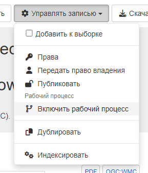
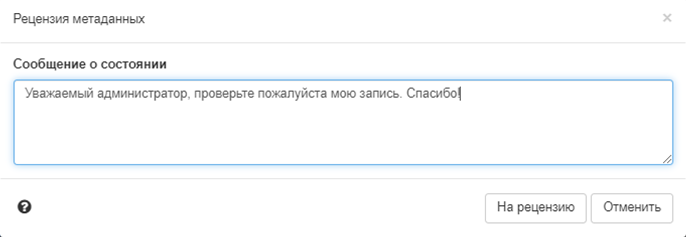
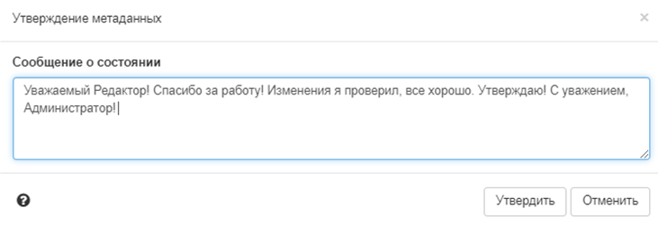
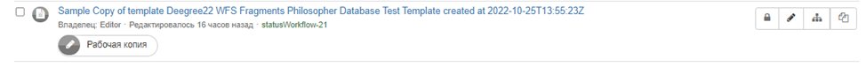

# Жизненный цикл

## Жизненный цикл записи

Записи метаданных имеют жизненный цикл, в процессе которого они проходят через несколько состояний. Например, когда запись:

- создается и редактируется `редактором`, она находится в состоянии `черновик`.
- просматривается `рецензентом контента` или запрашивается рецензия, запись переходит в состояние `Отправлено`.
- завершена и исправлена `рецензентом содержания`, она находится в состоянии `Утверждено`.
- замененная или вытесненная запись находится в состоянии `Удалена`.

В каталоге есть (расширяемый) набор состояний, которые может иметь запись метаданных:

- `Неизвестно (Unknown)` - это состояние по умолчанию - о статусе записи метаданных ничего не известно.
- `Черновик (Draft)` - запись находится в процессе создания или редактирования.
- `Отправлено (Submitted)` - запись была отправлена на утверждение для проверки контента.
- `Одобрено (Approved)` - рецензент контента рассмотрел и одобрил запись метаданных.
- `Отклонено (Rejected)` - специалист по обзору контента просмотрел и отклонил запись метаданных.
- `Удалено (Retired)` - запись была удалена.

Рабочий процесс может быть включен для всего каталога, определенных групп или на уровне отдельных записей.

!!! Примечание

    Чтобы включить рабочий процесс для всего каталога или определенных групп, следует зайти в Администрирование --> Настройки --> Рабочий процесс метаданных. В режиме рабочего процесса в случае изменения одобренных записей вы работаете с копией одобренной записи. Изменения в записи не будут видны пользователям вне вашей группы до тех пор, пока измененная запись не будет одобрена снова.

Чтобы включить рабочий процесс у отдельной записи и изменить статус с `Неизвестно` на `Черновик`, 
нужно выбрать `Управлять записью` - `Включить рабочий процесс` в представлении метаданных:



После завершения редактирования можно отправить запись на проверку рецензенту (`Управлять записью` - `На проверку`). 
Откроется всплывающее окно, в котором можно оставить сообщение для рецензента.



Пользователь с ролью «Рецензент» может утвердить запись: мгновенно одобрить свою запись (без отправки) или одобрить запись, 
которая была отправлена ему на рассмотрение. В процессе проверки рецензент может воспользоваться опцией истории версий, 
которая показывает различия между разными версиями записи. В процессе утверждения рецензент контента также может установить уровень доступа к записи, 
например, установить уровень доступа public (видимый для всех).



Редакторам и рецензентам будут отправляться уведомления об изменении статуса соответствующей записи. 
На странице панели редактора можно увидеть, какие записи обновляются или просматриваются на текущий момент. 
Отображается метка, указывающая, что для этой записи доступна «рабочая копия». Вы можете нажать на ярлык, чтобы перейти к текущей работе.




## Действия при изменении статуса

Существует два действия для изменения статуса (на Java), которые могут быть использованы сайтами для обеспечения определенного поведения:

- `statusChange (статус изменился)` - Это действие вызывается, когда статус изменяется пользователем, например, когда записи `Черновик` устанавливаются на `Отправлено`, и может быть использовано, например, для отправки уведомлений другим пользователям, затронутым этим изменением.
- `onEdit (редактируется)` - Это действие вызывается, когда запись редактируется и сохраняется, и может использоваться, например, для сброса записей со статусом `Утверждено` в статус `Черновик`.

Набор действий предоставляется по умолчанию. Они могут быть настроены или заменены сайтами, которые хотят обеспечить другое или более широкое поведение.

Пара действий по изменению статуса метаданных, определенных в Java, предоставляется по умолчанию в GeoNetwork с помощью класса org.fao.geonet.services.metadata.DefaultStatusActions.java (см. `core/src/main/java/org/fao/geonet/kernel/metadata/DefaultStatusActions.java`).

### При изменении статуса

Это действие вызывается при изменении статуса пользователем. Происходящее зависит от изменения статуса:

- когда пользователь-редактор изменяет состояние записи (записей) метаданных с `Черновик` или `Неизвестно` на `Отправлено`, рецензенты записи получают уведомление об изменении статуса по электронной почте, которое выглядит следующим образом. Они могут войти в систему и перейти по ссылке, указанной в письме, чтобы получить доступ к отправленным записям. Вот пример письма, отправленного этим действием:

    ``` text
    Date: Tue, 13 Dec 2011 12:58:58 +1100 (EST)
    From: Metadata Workflow <feedback@localgeonetwork.org.au>
    Subject: Metadata records SUBMITTED by userone@localgeonetwork.org.au (User One) on 2011-12-13T12:58:58
    To: "reviewer@localgeonetwork.org.au" <Reviewer@localgeonetwork.org.au>
    Reply-to: User One <userone@localgeonetwork.org.au.au>
    Message-id: <1968852534.01323741538713.JavaMail.geonetwork@localgeonetwork.org.au>

    These records are complete. Please review.

    Records are available from the following URL:
    http://localgeonetwork.org.au/geonetwork/srv/en/main.search?_status=4&_statusChangeDate=2011-12-13T12:58:58
    ```

- когда `Рецензент` изменяет состояние записи (записей) метаданных с `Отправлено` на `Принято` или `Отклонено`, владелец записи метаданных получает уведомление об изменении статуса по электронной почте. Электронное письмо, полученное владельцем записи метаданных, выглядит следующим образом. Пользователь также может войти в систему и воспользоваться ссылкой, указанной в письме, чтобы получить доступ к одобренным/отклоненным записям. Вот пример электронного письма, отправленного этим действием:

    ``` text
    Date: Wed, 14 Dec 2011 12:28:01 +1100 (EST)
    From: Metadata Workflow <feedback@localgeonetwork.org.au>
    Subject: Metadata records APPROVED by reviewer@localgeonetwork.org.au (Reviewer) on 2011-12-14T12:28:00
    To: "User One" <userone@localgeonetwork.org.au>
    Message-ID: <1064170697.31323826081004.JavaMail.geonetwork@localgeonetwork.org.au>
    Reply-To: Reviewer <reviewer@localgeonetwork.org.au>

    Records approved - please resubmit for approval when online resources attached

    Records are available from the following URL:
    http://localgeonetwork.org.au/geonetwork/srv/en/main.search?_status=2&_statusChangeDate=2011-12-14T12:28:00
    ```


### При редактировании

Это действие вызывается, когда запись редактируется и сохраняется пользователем. Если пользователь не указал, что изменения были незначительной правкой и текущий статус записи `Одобрена`, то по умолчанию будет установлен статус `Черновик`.

## Изменение действий со статусом

Эти действия могут быть заменены на различные варианты поведения путем:

- написания Java-кода в виде нового класса, реализующего интерфейс, определенный в `org.fao.geonet.services.metadata.StatusActions.java`, и размещения скомпилированной версии класса в пути классов GeoNetwork
- определение имени нового класса в параметре конфигурации statusActionsClass в файле `web/geonetwork/WEB-INF/config.xml`.