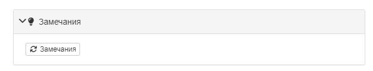
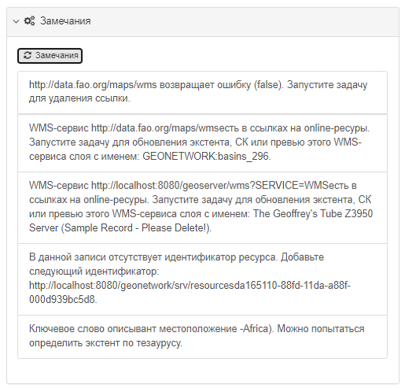

# Подсказки по улучшению метаданных {#metadata_suggestion}

Редактор метаданных можно настроить так, чтобы он анализировал метаданные и делал подсказки по их улучшению.

Процессы, доступные в данной схеме метаданных, определяются в файле схемы `suggest.xsl`, например <https://github.com/metadata101/iso19139.mcp/blob/master/src/main/plugin/iso19139.mcp/suggest.xsl>.

Файлы xsl для каждого процесса находятся в папке `process` внутри схемы.

Чтобы использовать службу подсказок для метаданных, она должна быть определена хотя бы в одном из представлений макета редактирования шаблона.

В режиме редактирования пользователь должен нажать на значок в мастере предложений, чтобы запустить службу подсказок для метаданных:

Если в процессе анализа программа не найдёт возможные улучшения метаданных, процесс не даст результатов. 
Если программа определит места, которые можно улучшить запись метаданных, это будет показано в результатах:

