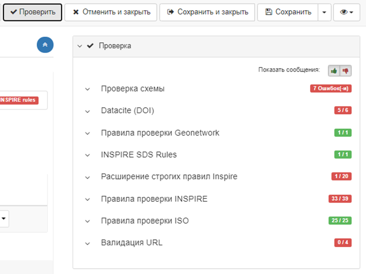
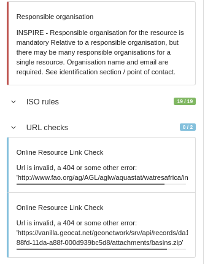
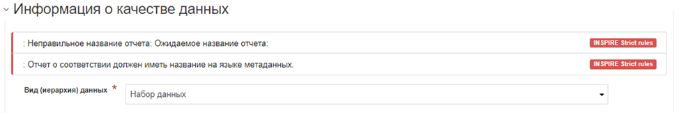
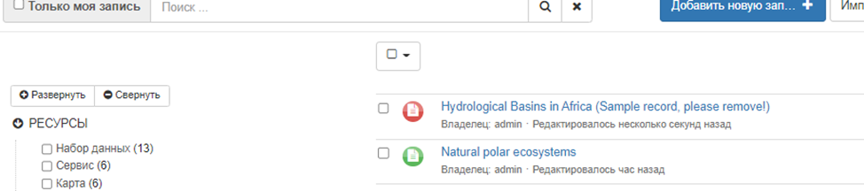

# Проверка записей метаданных {#validation}

1.  В редакторе записи метаданных нужно нажать кнопку `Проверка`, чтобы запустить проверку. На правой панели отображаются все результаты проверки по уровням проверки:

    

2.  Для отображения ошибок нажмите на значки больших пальцев вверх или вниз. Ошибки, выделенные синим цветом, предназначены только для информации и не влияют на глобальную проверку записи:

    

    Редактор также сообщает о сообщениях об ошибках прямо в форме около проблемных элементов, где это возможно:

    

3.  После проверки записи статус проверки сохраняется и отображается на странице панели редактора:

    

Пользователь может отфильтровать записи метаданных согласно их статусу проверки с помощью множественного выбора в панели редактора.

## Настройка проверки

Администраторы каталога могут настроить процесс проверки записи метаданных, чтобы она автоматически проводилась каждый раз, 
когда пользователь-редактор выходит или закрывает интерфейс редактирования метаданных (см. раздел [Конфигурация системы](../../administrator-guide/configuring-the-catalog/system-configuration.md)), 
а также настроить уровни проверки (см. [Настройка уровней проверки](../../administrator-guide/managing-metadata-standards/configure-validation.md)). В случае записей INSPIRE можно использовать удаленный валидатор (инструмент проверки) (см. [Валидация INSPIRE](../../administrator-guide/configuring-the-catalog/inspire-configuration.md#inspire-validation)).
