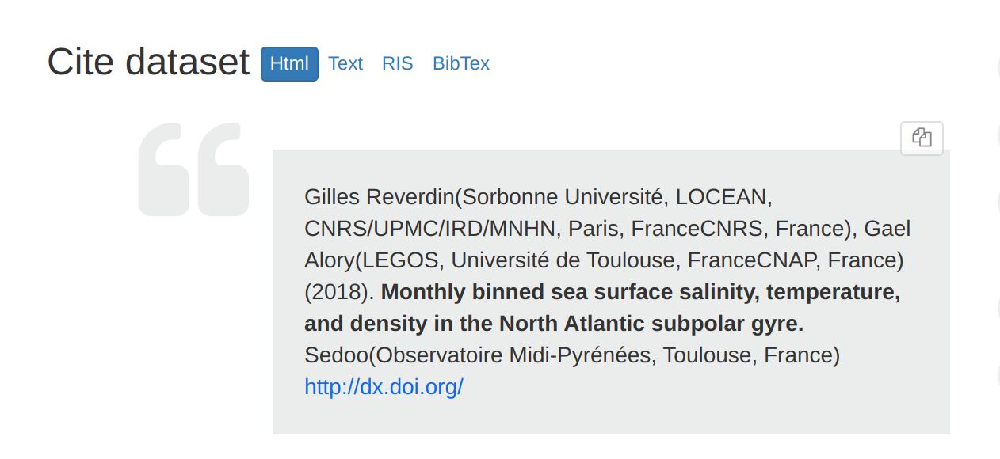
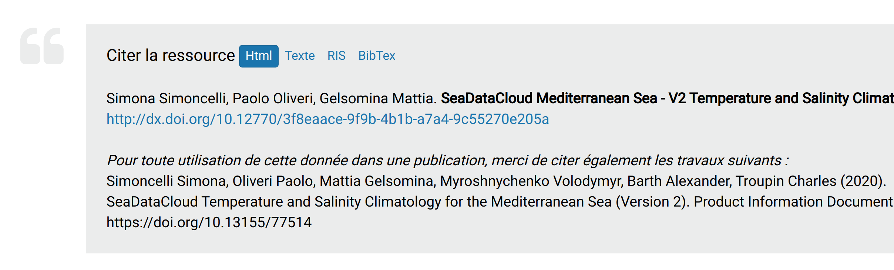
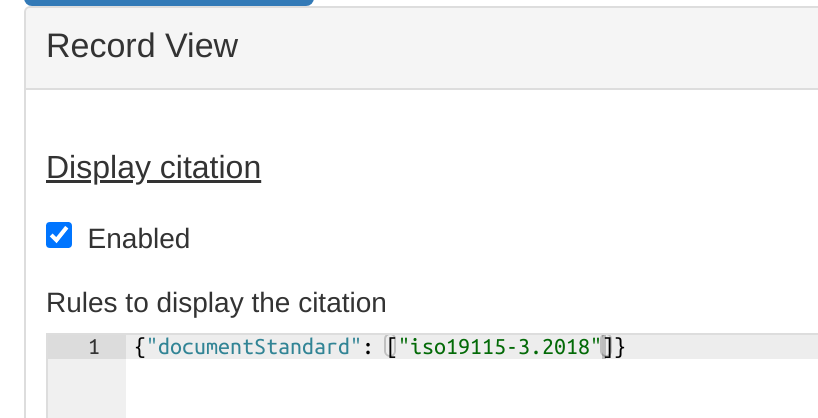

# Описание ссылки на другой ресурс {#cite}

Каталог может обеспечить автоматическое описание ссылки на другой ресурс на основе информации, предоставленной в записи метаданных.

Описание ссылки можно использовать для описания данных в публикациях.

## Текст описания ссылки

По умолчанию Описание ссылки генерируется в соответствии с общими правилами описания наборов данных, но может быть настроена.

По умолчанию это: * список авторов (и организации) * год публикации * название * список издательства * URL DOI или URL целевой страницы.

Это данные, необходимые для создания DOI (Digital Object Identifier - Идентификатор цифрового объекта) (см. [Идентификатор цифрового объекта (DOI)](doi.md)).

Настроить описании ссылки можно в `schemas/iso19115-3.2018/src/main/plugin/iso19115-3.2018/formatter/citation/common.xsl`.

Дополнительный текст может храниться в описании онлайн-ресурса с протоколом `WWW:LINK-1.0-http--publication-URL`.

Пример: <https://doi.org/10.12770/ad07a55f-5de7-4abc-ba89-8899b16c4b59>

## Конфигурация

Описание ссылки может отображаться или не отображаться в представлении записи. Проверьте конфигурацию пользовательского интерфейса, чтобы настроить его:

## Формат

Описание ссылки могут быть представлены в различных форматах:

- HTML
- простой текст
- RIS
- BibTex

## API

Описание ссылки можно отобразить в стандартном XSL-форматере, используемом для полного представления, используя: <http://localhost:8080/geonetwork/srv/api/records/a46af25c-f949-48a2-9b7e-ac472230cda8?language=all&citation=true>

Доступ к форматеру, создающему цитату, можно получить напрямую, используя: <http://localhost:8080/geonetwork/srv/api/records/31255efc-c5c1-7787-2ae6-b8fc4bcd6e55/formatters/citation?format=ris>

Для получения списка доступных форматов используйте: <http://localhost:8080/geonetwork/srv/api/records/31255efc-c5c1-7787-2ae6-b8fc4bcd6e55/formatters/citation?format=>?