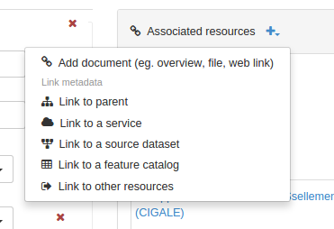

# Связывание со сторонними ресурсами {#associating_resources}

Вы можете связать запись метаданных с другими ресурсам с помощью панели `Связанные ресурсы`. В этом разделе описано, как связать ресурсы.

- Чтобы добавить или отредактировать связанные ресурсы, откройте страницу `Редактирование` и нажмите кнопку `Связанные ресурсы` для просмотра панели.

Используйте появившуюся панель для создания или удаления связанных ресурсов. Здесь же находиться список текущих связанных ресурсов, сгруппированных по типам.

- Чтобы добавить новый онлайн-ресурс, нажмите `Добавить ссылку`.

Вы можете связывать различные типы ресурсов:

- [Документов](linking-documents.md)
- [Другие записи](linking-records.md)
- [Идентификатор цифрового объекта (DOI)](doi.md)
- [Цитировать ресурс](cite.md)