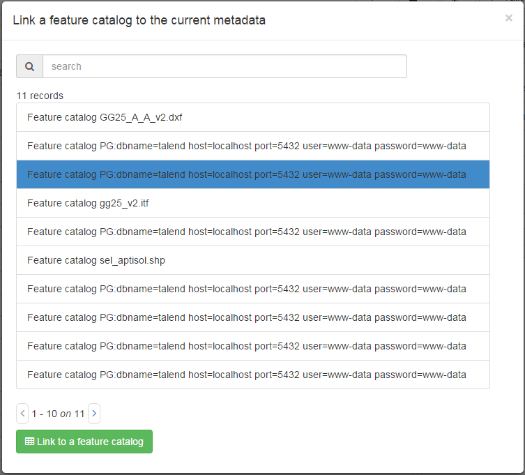

# Описание таблицы атрибутов в каталоге признаков {#linking-feature-catalog}

Каталог характеристик описывает модель данных набора данных со списком таблиц, атрибутов, определений, списком значений, \... Каталоги характеристик могут быть описаны:

- как документ (например, PDF) и связан с записью метаданных (см. [Связывание документов](linking-online-resources.md#linking-online-resources-doc))
- в виде записи и описаны с использованием стандартов ISO19110.

Нажмите на `Связать с каталогом характеристик`, чтобы открыть селектор записей, в котором перечислены все каталоги характеристик, описанные в каталоге. Выберите один из них и отправьте, чтобы связать два документа.

В ISO19115-3 каталог характеристик также может быть описан непосредственно в записи метаданных в разделе `содержание`.

!!! Информация "Todo"

    Добавить кодировку
