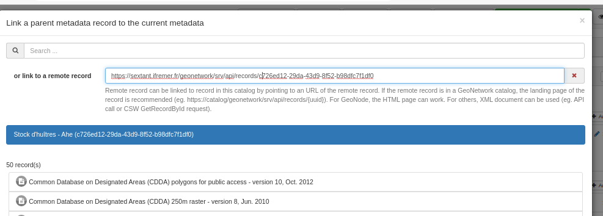
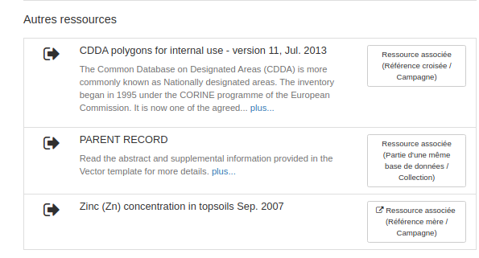

# Ссылка на удаленную запись {#linking-remote-record}

## Добавление ссылки

При кодировании отношения (например, родитель, источник, каталог характеристик, набор данных, сервис) у пользователя есть возможность указать страницу, описывающую удаленную запись.



Удаленная запись может быть связана с записью в этом каталоге путем указания на URL удаленной записи. Если удаленная запись находится в каталоге GeoNetwork, рекомендуется использовать целевую страницу записи (например, <https://catalog/geonetwork/srv/api/records/%7Buuid%7D>), которая возвращает XML, если для заголовка Accept установлено значение application/xml. Для GeoNode может работать HTML-страница, но UUID не будет идентифицирован. Заголовок будет HTML-заголовком страницы. Для остальных может использоваться XML-документ (например, вызов API или запрос CSW GetRecordById).

Для sibling, который позволяет добавлять несколько ссылок за один вызов, панель модифицирована для отображения ссылок в виде таблицы.


\... вместо простого списка

После добавления удаленные записи идентифицируются с помощью специального значка:


Тот же значок используется в режиме просмотра:



## Кодировка XML

Старая реализация кодирует ссылку на другую запись как

- uuidref

```xml
<gmd:source uuidref="704c6337-aaad-47a9-b300-08f28c0e48e9"/>
```

- или gco:CharacterString

``` xml
<gmd:parentIdentifier><gco:CharacterString>704c6337-aaad-47a9-b300-08f28c0e48e9<...
```

- или с помощью атрибутов uuidref, xlink:href, как для ссылок на сервис/набор данных.

При ссылке на удаленную запись редактор пытается собрать информацию об удаленной записи:

- название
- UUID

В настоящее время поддерживаются:

- ISO19139
- ISO19119
- ISO19110
- ISO19115-3
- Формат GeoNode HTML

В какой-то момент может оказаться актуальной поддержка тегов [schema.org](https://schema.org/) в HTML-странице или JSON+LD. После извлечения свойств удаленной записи ссылка будет добавлена обычным способом (те же процессы, но с 2 дополнительными необязательными параметрами) следующим образом:

``` xml
<gmd:source uuidref="fff43204-793a-4a44-96f7-918672a2047d"
            xlink:href="https://sdi.eea.europa.eu/catalogue/srv/api/records/fff43204-793a-4a44-96f7-918672a2047d"
            xlink:title="Прилов донными трогательными мобильными орудиями лова, янв. 2020 г." />
```

## Поддерживаемые стандарты

Исходный документ

- ISO19139
- Реализация ISO19115-3 выполнена в metadata101/iso19115-3.2018#81

Целевой документ

- внутренняя запись: Любые стандарты, поддерживаемые GeoNetwork
- удаленная запись: Стандарты ISO или HTML-страница (например, GeoNode)