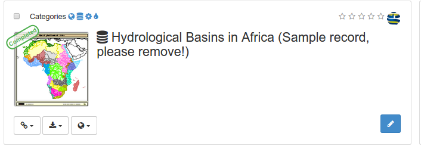
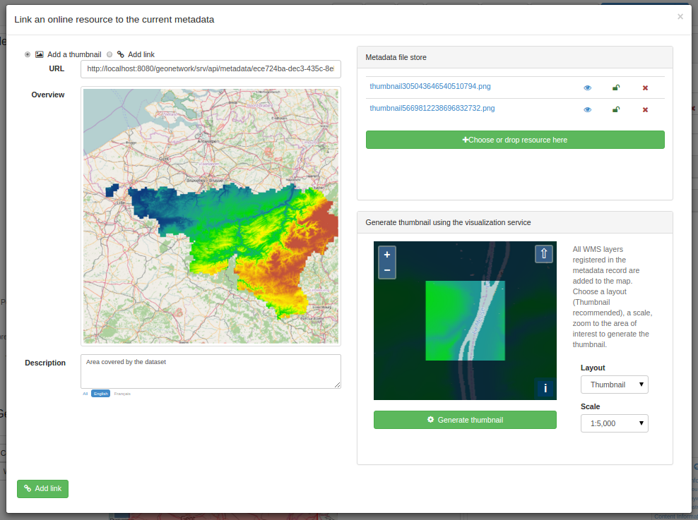
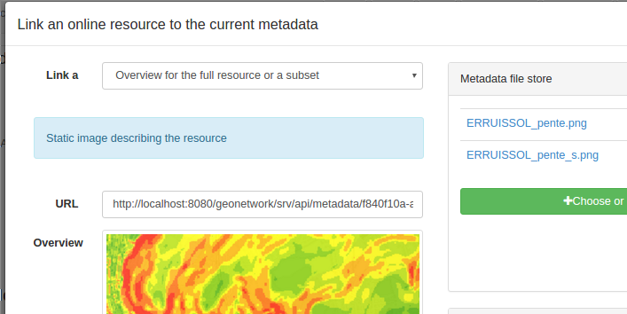
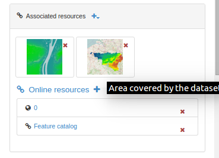

# Аватар-изображение связанных ресурсов {#linking-thumbnail}

Чтобы помочь пользователю определить интересующую запись среди всех связанных ресурсов, вы можете создать аватар-изображение (или миниатюру) связанного ресурса и прикрепить его к записи метаданных. Например, если запись метаданных описывает некоторый набор географических данных, аватар-изображение может представлять собой изображение карты.

Вы можете связать с записью несколько аватар-изображений.

Изображения отображаются в результатах поиска и в представлении метаданных:

На панели `Связанные ресурсы` нажмите кнопку `Добавить ссылку`, чтобы открыть окно ссылку. Аватар-изображения можно добавлять из трех источников:

- из URL-адреса в Интернете
- Из файла, прикрепленного к метаданным
- Из файла, созданного с использованием слоев WMS

## Ссылка на обзор с помощью URL-адреса

Если ресурс доступен в виде изображения в Интернете, его можно напрямую связать с записью метаданных. Добавьте необязательное описание для описания изображения:

Если ресурс недоступен, с помощью кнопки `Добавить миниатюру` прикрепите изображение (png, gif, jpeg) в хранилище файлов (см. [Uploading attachments](using-filestore.md)) и щелкните его имя, чтобы задать URL:

Вы можете связать столько изображений, сколько захотите. Изображения, связанные в этом режиме, должны быть общедоступными в Интернете, если вы хотите, чтобы обзоры отображались правильно, даже если эта запись метаданных будет собрана другими каталогами.

## Генерирование миниатюры с использованием слоев WMS {#linking-thumbnail-from-wms}

Если вы зарегистрировали слой WMS в текущей записи метаданных (см. [Linking a WMS layer](linking-online-resources.md#linking-wms-layer)), можно создать миниатюру, используя ее поверх карты базового слоя. Выберите вкладку `Создать миниатюру` и выберите область, которая будет напечатана на миниатюре. Созданное изображение добавляется в хранилище файлов.

