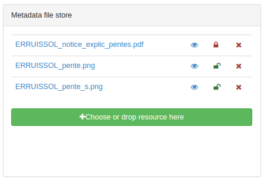

# Прикрепление файлов с компьютера {#associating_resources_filestore}

!!! Информация

    Добавлено в версии GeoNetwork 3.2 .

Если отсутствует возможность связать запись метаданных с онлайн-ресурсом , пользователь может прикрепить вложение (документ, фотографию и др.) к записи метаданных. Вложение сохраняется в хранилище файлов программы. Хранилище файлов может содержать любые типы файлов.

Чтобы прикрепить файл, нажмите `Связанные ресурсы` - `Добавить ссылку` и выберите файл или перетащите файл. Файлы хранятся в папке в каталоге данных (см. [Настройка каталога данных](../../install-guide/customizing-data-directory.md)). В каждой папке метаданных содержится одна папка:

- `public` папку с файлами, доступными всем пользователям
- `private` папку с файлами, доступными только идентифицированному пользователю с привилегией загрузки (см. [Управление привилегиями](../publishing/managing-privileges.md)).

Из хранилища файлов:

- нажмите на имя файла, чтобы установить URL-адрес текущего документа для прикрепления
- нажмите на значок глаза, чтобы просмотреть документ
- нажмите на шкафчик, чтобы изменить видимость документа
- нажмите на крестик, чтобы удалить файл.

Файл, загруженный таким образом, будет экспортирован в файл экспорта метаданных (MEF). Поэтому его URL-адрес не будет автоматически добавлен в метаданные. URL добавляется при прикреплении документа к определенному элементу метаданных (например, обзор, отчет о качестве, легенда).

## Конфигурация хранилища файлов

По умолчанию максимальный размер файла установлен на 100 Мб. Это ограничение задается в файле `/services/src/main/resources/config-spring-geonetwork.xml` с помощью параметра `maxUploadSize`.
