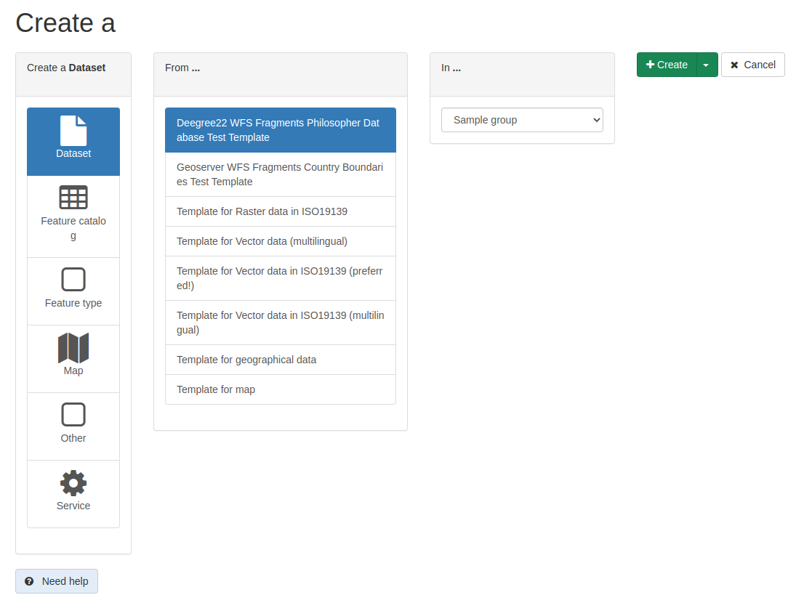

# Создание новой записи {#creating-metadata}

Это руководство описывает процесс добавления в каталог новых записей метаданных и связанных с ними данных или сервисами.

## Прежде чем начать

Чтобы добавить или отредактировать метаданные, пользователь:

- Должен иметь профиль `редактора` или выше.
- Должен быть членом группы, для которой вы хотите добавить информацию.

Обратитесь к администратору, если у вас нет нужного профиля.

1.  На главной странице перейдите в раздел *contribute* или нажмите в меню `add new record`.

    

2.  В списке шаблонов метаданных выберите шаблон (см. [Управление шаблонами](managing-templates.md)), выберите группу из выпадающего списка и нажмите *Create*.

    

!!! Примечание

    Если в каталоге определена только одна группа, она будет выбрана группа по умолчанию.

Следующие шаги:

- Заполните поля, предусмотренные по умолчанию в шаблоне.
- Создайте изображение ваших данных, чтобы проиллюстрировать их в результатах поиска.