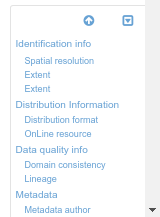

# Редактирование метаданных

В этом разделе описывается, как пользоваться редактором метаданных.

## Использование панели инструментов редактора

Откройте раздел *Редактирование* и нажмите кнопку `Редактировать` у записи метаданных, которую нужно изменить. Откроется страница редактирования записи. Верхняя панель инструментов предоставляет наиболее важные функции, доступные редактору:

Слева направо:

- `Категории` для выбора категории у метаданных
- `Группа` для выбора группы метаданных
- `Проверить` для запуска проверки записи метаданных на соответствие стандарту
- `Отменить и закрыть` для отмены всех изменений, сделанных с начала сеанса редактирования
- `Сохранить и закрыть` для сохранения и закрытия редактора
- `Сохранить` для сохранения метаданных или шаблона. Выпадающий список также позволяет обозначить, являются ли правки незначительными (т. е. дата изменения метаданных не будет обновляться в случае незначительных правок).
- `Режим просмотра` изменения режима просмотра формы редактора, включение всплывающих подсказок или переключение в расширенный режим редактора

## Навигация по форме
Для описания ресурса использует форму выбранного шаблона. Имеется 3 режима просмотра и взаимодействия с формой:

- `По умолчанию`, отображающий все поля из метаданных
- `Детальный вид`, основанное на стандарте метаданных и предоставляющее доступ ко всем дескрипторам из используемого стандарта метаданных
-  `XML`, отображающее запись в виде XML-документа.

Чтобы переключиться с одного вида на другой, используйте меню `Режим просмотра`:

После выбора режима просмотра пользователь может просмотреть и начать редактировать поля формы. Для быстрой навигации можно использовать кнопку `Навигация` в правом нижнем углу.

Кнопку `Навигация` выделяет видимые разделы, помогает пользователю вернуться в верхнюю часть формы и может быть свернут при необходимости.

## Заполнение полей

!!! info "Todo"

    Добавьте подробности об элементах управления добавлением/удалением/каталогом

!!! info "Todo"

    Добавление подробностей о каталоге / тезаурусе

В зависимости от конфигурации представления (см. [Настройка редактора](../../customizing-application/editor-ui/creating-custom-editor.md)), пользователи могут упорядочивать элементы с помощью элементов управления вверх и вниз.

