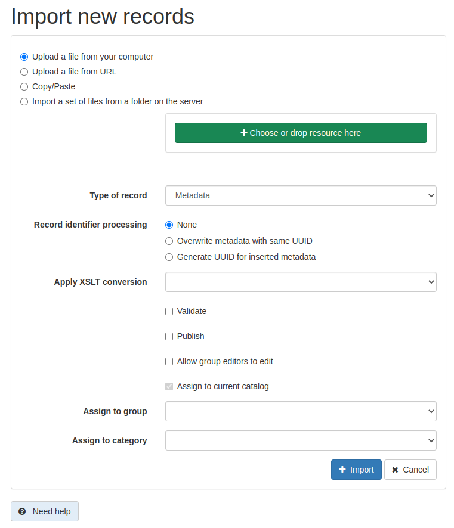

# Импорт новой записи метаданных {#import1}

Пользователь может импортировать метаданные в файл каталога в различных форматах: XML, MEF или ZIP (см. [Metadata Exchange Format (MEF)](../../annexes/mef-format.md)).

## Прежде чем начать

Для доступа к метаданным пользователь должен иметь профиль `редактор`.

1.  Перейдите на страницу `Редактирование` и выберите `Импорт новых записей`.

    

    Используя страницу импорта новых записей, вы можете:

    - выбрать `Загрузить файл с компьютера` 
    - выбрать `Загрузить файл по URL`
    - выбрать `Копировать/Вставить` и скопировать XML-документ в текстовую область
    - выбрать `Импортировать набор файлов из папки на сервере` и задать путь к папке на сервере.

    Чтобы импортировать несколько файлов за раз, используйте опции формата MEF или импорта с сервера.

2.  После определения типа импорта настройте другие параметры импорта:

    

    - `Тип файла`: при загрузке или загрузке файла с сервера определите тип загружаемого файла. Это может быть XML для импорта XML-документа или MEF (эквивалент ZIP) для импорта формата MEF.
    - `Тип записи`:  

        - Используйте `Метаданные` при загрузке обычной записи метаданных.
        - Используйте `Шаблон`, если загруженная запись метаданных будет использоваться в качестве шаблона.

    - `Обработка идентификатора записи` определяет, как обрабатывать потенциальные столкновения между UUID загружаемой записи и UUID записей метаданных, уже присутствующих в каталоге. Доступны 3 стратегии:

        - `None`: UUID загружаемой записи остается неизменным. Если запись метаданных с таким же UUID уже присутствует в каталоге, возвращается сообщение об ошибке.
        - `Перезаписать метаданные с тем же UUID`: все существующие в каталоге записи метаданных, имеющие тот же UUID, что и загруженная запись, будут обновлены.
        - `Генерировать UUID для вставленных метаданных`: загруженная запись получит новый UUID.

    - `Применить XSLT-преобразование` позволяет преобразовать загруженную запись с помощью таблицы стилей XSLT. Предоставляется список предопределенных преобразований. Выбранное преобразование должно быть совместимо со стандартом загружаемой записи (см. раздел [Добавление XSLT-преобразования для импорта](../workflow/batchupdate-xsl.md#customizing-xslt-conversion)).
    - `Проверить` запускает проверку записи перед ее загрузкой. В случае ошибки запись отклоняется и сообщается об ошибке.
    - `Прикрепить к текущему каталогу` назначить текущий каталог в качестве источника для записи, в случае если в файле MEF указан другой источник.
    - `Приписать к группе` определяет группу загружаемой записи.
    - `Приписать к категории` определяет локальную категорию, которая будет присвоена загружаемой записи.

3. Нажмите `Импорт`, чтобы запустить импорт. После обработки появится сводка, содержащая следующие сведения:

    - общее количество импортированных метаданных
    - сообщения об ошибках
    - если импортирована только одна запись, предоставляется ссылка на эту запись.