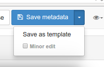
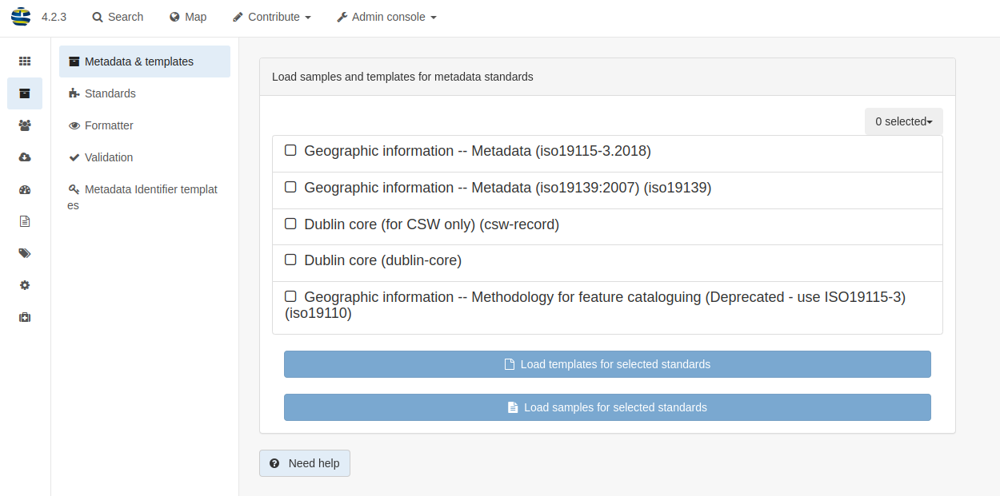

# Управление шаблонами {#creating-templates}

Шаблоны - это записи метаданных, которые пользователь может использовать в основы для описания новых ресурсов. В этой теме описывается, как создавать шаблоны и управлять ими.

## Создание и управление шаблонами

Пользователь может:

- Управлять шаблонами в каталоге так же, как и записями метаданных, с помощью специального тега 'template'.
- Создавать, обновлять и удалять шаблоны с помощью раздела `Редактирование`.
- Преобразовывать записи метаданных в шаблоны и наоборот в любое время из редактора метаданных с помощью кнопки `Сохранить как шаблон`.

Пользователь может назначить шаблоны ограниченным группам, чтобы только эти группы могли использовать шаблон в своем рабочем процессе (см. раздел [Управление привилегиями](../publishing/managing-privileges.md)).

## Загрузка шаблонов по умолчанию

Страница `Стандарты и шаблоны` на странице администрирования отображает стандартные шаблоны по умолчанию.

Если вы указали администратор открыл доступ, то с помощью этой страницы пользователи могут:

- загрузить образцы по умолчанию
- загружать шаблоны по умолчанию

**Примечание**: Вы должны войти в систему как администратор, чтобы получить доступ к этой странице и функциям.

## Импорт шаблонов

Альтернативным способом загрузки шаблонов является использование страницы импорта метаданных, где вы можете импортировать XML-файлы, выбрав тип записи: `Шаблон`.

## Создание собственных шаблонов

Каждый стандарт предоставляет образцы по умолчанию, но пользователь может создать свой собственный шаблон, чтобы максимально упростить задачу редактирования в зависимости от:

- типа ресурсов, которые необходимо описать (например, шаблон для бумажных карт)
- структуры вашей организации (например, определение шаблонов для служб)
- типа использования метаданных (например, публичное использование, внутреннее использование, качество данных)
- типа пользователей.

В шаблоне следует:

- установить как можно больше значений по умолчанию (например, определить контакт по умолчанию)
- создавать элементы, которые рекомендует ваше руководство по кодированию (чтобы не тратить время на поиск элементов в расширенном представлении)
- предоставлять инструкции

Основная задача шаблонов - направить работу редактора, не требуя больших знаний о деталях различных стандартов метаданных.

В качестве продвинутой настройки пользователь может использовать расширения для работы с записями метаданных, определив пользовательскую документацию, рекомендуемые значения, \... (см. [Использование расширений в работе с метаданными](../../customizing-application/implementing-a-schema-plugin.md)) или создать пользовательский интерфейс (см. [Улучшение окна "Редактирования"](../../customizing-application/editor-ui/creating-custom-editor.md)).