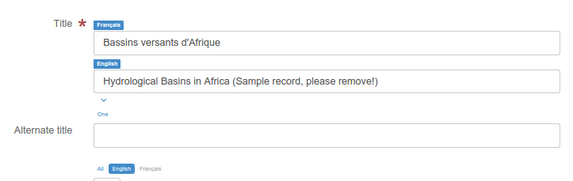

# Многоязычное редактирование

Несколько стандартов поддерживают многоязычные метаданные (например, ISO19139, ISO19115-1). Для ISO19139 предусмотрен шаблон по умолчанию, но пользователь может добавить перевод к существующей записи.

Чтобы объявить новый язык в записи метаданных, выполните следующие действия:

1. Проверьте основной язык, определенный в разделе метаданных.
2. Добавьте один или несколько языков в `другой язык` в разделе метаданных.
3. После этого в форме редактора появится одно поле для каждого заявленного языка. Существует 2 типа макетов:

    - Одно поле для каждого языка, отображаемое одно под другим (например, режим по умолчанию для заголовка) для просмотра всех доступных переводов
    - Одно поле для каждого языка со списком языков для переключения между ними.

## Переключение режимов макета

Чтобы переключиться из одного режима в другой, используйте ссылку `Все`.

- При загрузке окна редактирования выбранным языком является язык пользовательского интерфейса, если этот язык определен в текущей записи.
- При просмотре записи, если существует перевод на язык пользовательского интерфейса, используется этот перевод; если нет, используется основной язык метаданных.

!!! Примечание

    Это поведение также применяется к многоязычным записям ISO19139, запрашиваемым в dublin core из служб CSW.