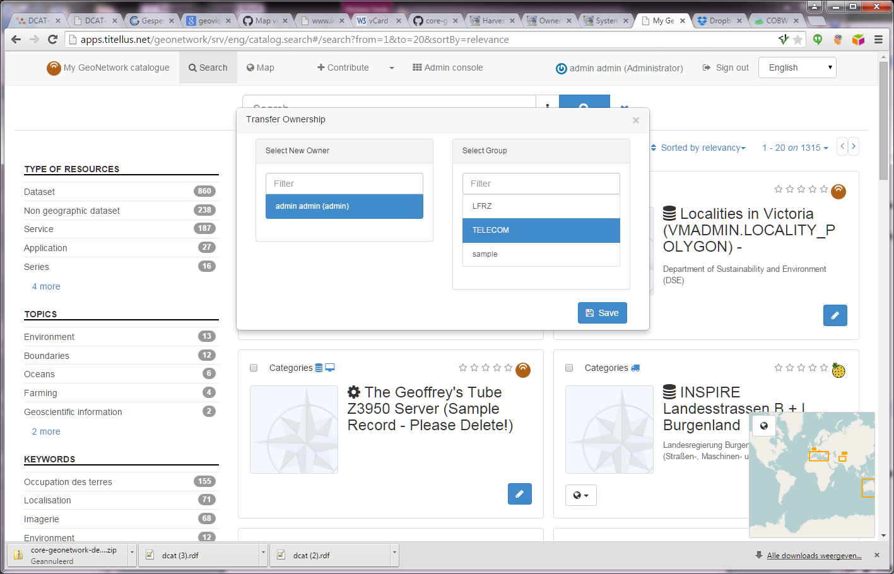

# Передача привилегий

## Передача владения метаданными

Когда необходимо передать право владения метаданными от одного пользователя другому для всех или определенных записей метаданных, следует использовать опцию *Передача права владения*.

Чтобы *передать право владения* нужно:

1. Из "действий над выбранным набором" в панеле редактора нажать `Передать право владения`.

Действия в панели `Передача права владения`:

- **Выбрать нового владельца**: выбрать пользователя с помощью поля с автодополнением.

!!! Примечание

Раскрывающийся список содержит только редакторов, которых пользователь *может* видеть. Если пользователь не является администратором, он сможет увидеть только определённое число всех редакторов.

- **Выбрать группу**: выберите одну из групп, членом которой является этот пользователь. Права для групп "Все" и "Внутренняя сеть" не передаются.