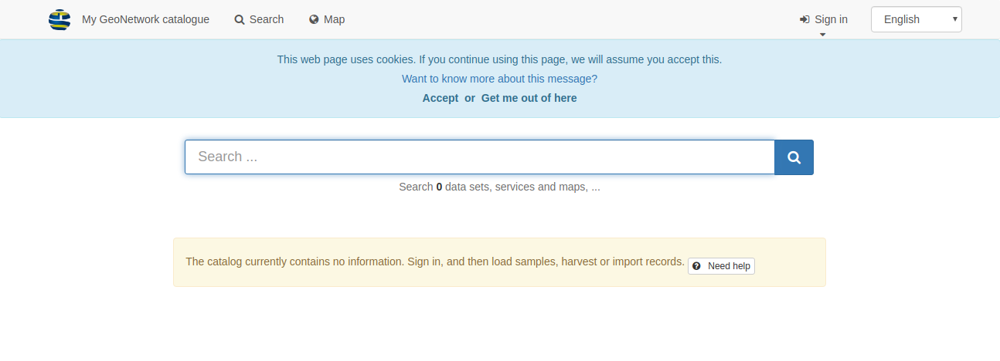
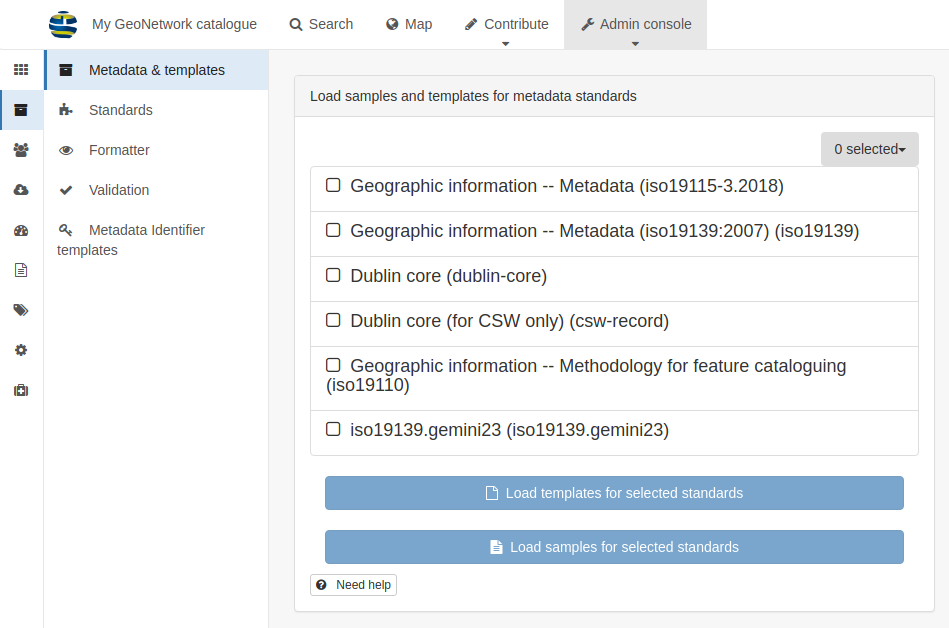

# Быстрый старт {#quick_start}

GeoNetwork - это приложение-каталог для управления пространственными ресурсами. Он предоставляет мощные функции редактирования метаданных и поиска, а также интерактивный веб-просмотрщик карт. В настоящее время он используется во многих инициативах по созданию пространственной инфраструктуры данных по всему миру.

В этом кратком руководстве также описывается:

- несколько способов поиска пространственных данных
- как загружать и отображать данные из результатов поиска

## Запуск каталога

В этом разделе описано, как запустить GeoNetwork после установки на вашем компьютере.

**Прежде чем начать:**

Убедитесь, что вы успешно установили GeoNetwork, следуя инструкциям в разделе `Установка приложения`.

Чтобы запустить каталог:

1. Из папки GeoNetwork откройте папку bin и дважды щелкните start.bat (в Windows) или startup.sh (в Linux). Это запускает веб-сервис для GeoNetwork, который вы можете использовать для просмотра каталога.

Совет: Если вы используете командную строку, вы можете просмотреть сообщения журнала непосредственно в консоли.

2. Откройте веб-браузер и перейдите на домашнюю страницу GeoNetwork. Если вы установили его на свой компьютер, используйте эту ссылку ``http://localhost:8080/geonetwork``.

3. Отобразится страница каталога GeoNetwork.

4. После запуска каталога вы можете войти в систему, чтобы просмотреть дополнительные опции, найти конкретные ресурсы или перейти к подробной информации о ресурсе.

## Вход в систему и загрузка шаблонов

В этом разделе описано, как войти в систему, используя данные для входа администратора, и загрузить шаблоны, чтобы просмотреть примеры ресурсов в каталоге GeoNetwork.

1. На домашней странице GeoNetwork в верхнем меню нажмите `Вход`, чтобы подключиться как администратор. Отобразится страница входа в систему.

2. Введите имя пользователя и пароль, затем нажмите `Вход`. Сведения учетной записи администратора по умолчанию: имя пользователя `admin` с паролем `admin`. После входа в систему на верхней панели инструментов отображаются `панель администратора` и ваши данные для входа.

3. Перейдите в `панель администратора` и нажмите `метаданные и шаблоны`:

4. На странице `Метаданные и шаблоны` выберите все стандарты из списка `Доступные стандарты` и:

a. Нажмите `Загрузить примеры` и
b. Нажмите `Загрузить шаблоны`, чтобы загрузить примеры.

5. В верхнем меню нажмите `Поиск`, чтобы просмотреть примеры:

## Searching information

You can use the Search form to search information using the GeoNetwork catalog. The Search form allows you to search using:

- a full text search box providing suggestions

- facets which defines groups that you can click to browse the content of the catalog

- spatial filtering to choose information in specific areas

- advanced search

## Discovering information

Search results display main information about each resources: title, abstract, categories, status, overview and links.

To view detailed information about the resources, click the record. These details include:

- Download and links

- About the resource

- Technical information

- Metadata details

- To get more information, switch the advanced view mode.

- To update the record, click Edit.

From the results or the record view, you can add WMS layers referenced in a metadata record on the map. Using the map, you can:

- Visualize your data,

- Choose your background maps,

- Query objects,

- Display on a 3D globe

Read more about use of the [Maps and dataset visualisation](../map/index.md)

## Searching information

You can use the Search form to search information using the GeoNetwork catalog. The Search form allows you to search using:

- a full text search box providing suggestions

- facets which defines groups that you can click to browse the content of the catalog

- spatial filtering to choose information in specific areas

- advanced search

## Discovering information

Search results display main information about each resources: title, abstract, categories, status, overview and links.

To view detailed information about the resources, click the record. These details include:

- Download and links

- About the resource

- Technical information

- Metadata details

- To get more information, switch the advanced view mode.

- To update the record, click Edit.

From the results or the record view, you can add WMS layers referenced in a metadata record on the map. Using the map, you can:

- Visualize your data,

- Choose your background maps,

- Query objects,

- Display on a 3D globe

Read more about use of the [Maps and dataset visualisation](../map/index.md)