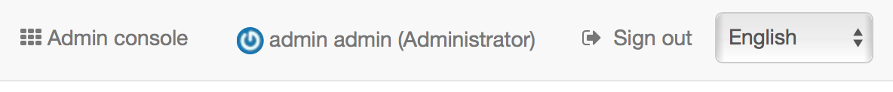
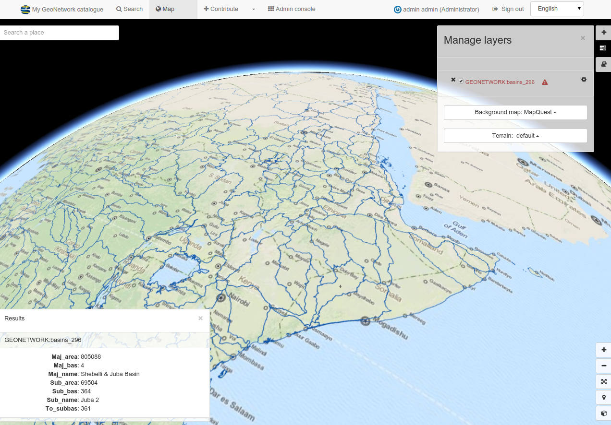

# Быстрый старт {#quick_start}

GeoNetwork - это приложение для управления метаданными пространственных ресурсов. Оно предоставляет возможности по созданию, редактированию и поиску метаданных, а также по интерактивному просмотру опубликованных геоданных. GeoNetwork достаточно широко используется в многочисленных инициативах в области инфраструктуры пространственных данных (ИПД) по всему миру.

В разделе "Быстрый старт" описывается:

-    способы поиска пространственных данных
-    как загружать и отображать данные из результатов поиска

## Запуск каталога

В этом разделе описано, как запустить GeoNetwork после установки на вашем компьютере.

!!! note "Примечание"

    Прежде чем начать стоит убедиться, что GeoNetwork успешно установлен (смотреть раздел [Установка приложения](../../install-guide/index.md)).

Для запуска GeoNetwork необходимо:

-   Из папки GeoNetwork откройте папку bin и дважды щелкните start.bat (в Windows) или startup.sh (в Linux). Это запускает веб-службу для GeoNetwork, который можно использовать для просмотра каталога.

!!! info "Примечание"
    Если командные файлы выполнить из командной строки, то можно просматривать сообщения о ходе запуска и работы GeoNetwork прямо в консоли.

-   В веб-браузере нужно перейти на начальной страницу GeoNetwork. Если приложение установлено на локальном компьютере, то по ссылке `http://localhost:8080/geonetwork` отобразиться начальная страница каталога GeoNetwork.

-   После запуска каталога можно войти в систему, чтобы начать работу в приложении.

## Вход в систему и загрузка шаблонов

Далее описывается, как войти в систему, используя учётные данные администратора, а также как загрузить шаблоны метаданных и сами примеры метаданных в каталоге GeoNetwork.

-   На начальной странице GeoNetwork в верхнем меню нужно нажать `Войти`. Отобразится страница входа в систему.

-   Введите имя пользователя и пароль, затем нажмите `Войти`. Чтобы подключиться как администратор, нужно ввести учётные данные администратора по умолчанию: имя пользователя - `admin`, пароль - `admin`. После входа в систему справа вверху на панели меню отобразятся данные входа.

-   Перейдите в `Администрирование` и нажмите `Стандарты и шаблоны`:

-   На странице `Стандарты и шаблоны` выберите все стандарты из списка *Стандарты метаданных* и:

    -   Нажмите `Загрузить шаблоны для выбранных стандартов` и
    -   Нажмите `Загрузить образцы для выбранных стандартов`, чтобы загрузить примеры записей метаданных для выбранных стандартов.

-   В верхнем меню нажмите `Поиск`, чтобы просмотреть загруженные примеры записей метаданных:

## Поиск информации
Поиск информации в GeoNetwork осуществляется на странице поиска (кнопка `Поиск` в хедере). Поиск можно осуществлять несколькими способами:

- форма текстового поиска с рекомендованными вариантами

- интерфейс фильтра, разбивающего данные на различные категории и группы (находится в левой части интерфейса)

- пространственная фильтрация на миникарте для выбора информации в определенных областях

- расширенный поиск

## Просмотр информации

В результатах поиска отображаются записи с информацией о различных ресурсах. Это и есть метаданные. Каждая запись в результатах поиска содержит основную информацию: название, аннотация, категории, статус, превью, ссылки, логотипы портала-источника.

Чтобы просмотреть подробную информацию о ресурсе, нужно кликнуть на соответсвующую запись. Откроется, так называемый, `Вид по умолчанию`, включающий следующие разделы:

- *Общая информация*

- *Обзор данных (на карте)*

- *API*

- *Формат*

- *Скачать*

- *Ссылки*

- *Техническая информация*

- *Происхождение*

- *Дополнительная информация*

- *Контактные данные*

- *Информация о метаданных*

- Чтобы получить более подробную информацию, следует переключить режим просмотра в детальный (`Отобразить` - `Детальный вид`).

- Чтобы обновить запись, нужно нажать кнопку `Редактировать`.

Из результатов поиска или непосредственно из записи можно добавить на карту слои WMS (кнопка `Карта` в хедере), на которые ссылается запись метаданных. Используя карту, можно:

- Визуализировать свои данные,

- Выбирать фоновые карты,

- Запрашивать объекты,

- Отображать на 3D-глобусе

Подробнее об использовании [Карты и визуализация наборов данных](../map/index.md)
