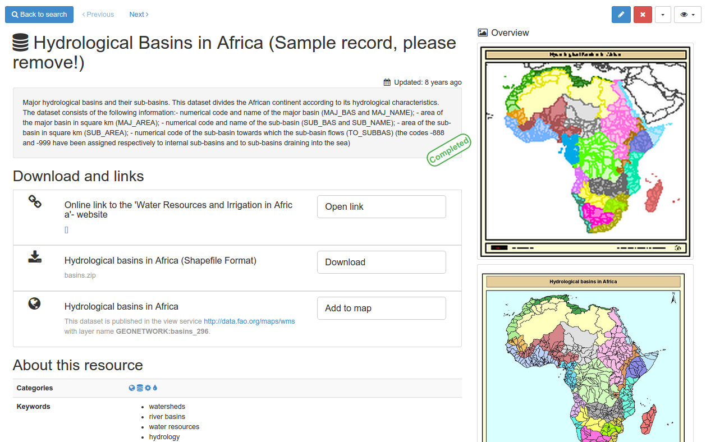

# Быстрый старт {#quick_start}

GeoNetwork - это приложение-каталог для управления пространственными ресурсами. Он предоставляет мощные функции редактирования метаданных и их поиска, а также интерактивный веб-просмотрщик карт. В настоящее время он используется во многих организациях по созданию пространственной инфраструктуры данных по всему миру.

В этом кратком руководстве также описывается:

- способы поиска пространственных данных
- как загружать и отображать данные из результатов поиска

## Запуск каталога

В этом разделе описано, как запустить GeoNetwork после установки на вашем компьютере.

**Прежде чем начать:**

Убедитесь, что вы успешно установили GeoNetwork, следуя инструкциям в разделе `Установка приложения`.

Чтобы запустить каталог:

1. Из папки GeoNetwork откройте папку bin и дважды щелкните start.bat (в Windows) или startup.sh (в Linux). Это запускает веб-сервис для GeoNetwork, который вы можете использовать для просмотра каталога.

Совет: Если вы используете командную строку, вы можете просмотреть сообщения журнала непосредственно в консоли.

2. Откройте веб-браузер и перейдите на домашнюю страницу GeoNetwork. Если вы установили его на свой компьютер, используйте эту ссылку ``http://localhost:8080/geonetwork``.

3. Отобразится страница каталога GeoNetwork.

4. После запуска каталога вы можете войти в систему, чтобы просмотреть дополнительные опции, найти конкретные ресурсы или перейти к подробной информации о ресурсе.

## Вход в систему и загрузка шаблонов

В этом разделе описано, как войти в систему, используя администраторские реквизиты для входа, и загрузить шаблоны записей метаданных, чтобы просмотреть примеры ресурсов в каталоге GeoNetwork.

1. На домашней странице GeoNetwork в верхнем меню нажмите `Войти`. Отобразится страница входа в систему.

2. Введите имя пользователя и пароль, затем нажмите `Войти`. Чтобы подключиться как администратор введите реквизиты администратора по умолчанию: имя пользователя `admin` с паролем `admin`. После входа в систему на верхней панели инструментов отображаются `Администрирование` и ваши данные для входа.

3. Перейдите в `Администрирование` и нажмите `Стандарты и шаблоны`:

4. На странице `Стандарты и шаблоны` выберите все стандарты из списка *Стандарты метаданных* и:

a. Нажмите `Загрузить шаблоны для выбранных стандартов` и
b. Нажмите `Загрузить образцы для выбранных стандартов`, чтобы загрузить примеры записей метаданных для выбранных стандартов.

5. В верхнем меню нажмите `Поиск`, чтобы просмотреть загруженные примеры записей метаданных:

## Поиск информации
Поиск информации в GeoNetwork осуществляется на странице поиска (кнопка `Поиск` в хедере). Поиск можно осуществлять несколькими способами:

- форма текстового поиска с рекомендованными вариантами

- интерфейс фильтра, разбивающего данные на различные категории и группы (находится в левой части интерфейса)

- пространственная фильтрация на миникарте для выбора информации в определенных областях

- расширенный поиск

## Просмотр информации

В результатах поиска отображается основная информация о каждом ресурсе: название, аннотация, категории, статус, обзор и ссылки.

Чтобы просмотреть подробную информацию о ресурсах, кликните на запись. Информация о ресурсе включают следующие разделы:

- *Общая информация*

- *Обзор данных (на карте)*

- *API*

- *Скачать*

- *Техническая информация*

- *Дополнительная информация*

- *Контактные данные*

- Чтобы получить более подробную информацию, переключите режим расширенного просмотра (`Отобразить` - `Детальный вид`).

- Чтобы обновить запись, нажмите кнопку `Редактировать`.

Из результатов поиска или непосредственно из записи можно добавить на карту слои WMS (кнопка `Карта` в хедере), на которые ссылается запись метаданных. Используя карту, вы можете:

- Визуализировать свои данные,

- Выбирать фоновые карты,

- Запрашивать объекты,

- Отображать на 3D-глобусе

Подробнее об использовании [Карты и визуализация наборов данных](../map/index.md)
