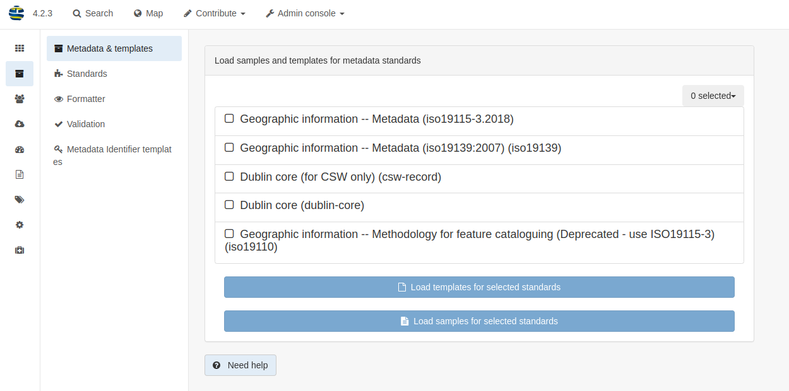
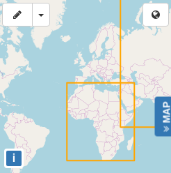

# Быстрый старт {#quick_start}

GeoNetwork - это приложение-каталог для управления пространственными ресурсами. Он предоставляет мощные функции редактирования метаданных и поиска, а также интерактивный веб-просмотрщик карт. В настоящее время он используется во многих инициативах по созданию пространственной инфраструктуры данных по всему миру.

В этом кратком руководстве также описывается:

- несколько способов поиска пространственных данных
- как загружать и отображать данные из результатов поиска

## Запуск каталога

В этом разделе описано, как запустить GeoNetwork после установки на вашем компьютере.

**Прежде чем начать:**

Убедитесь, что вы успешно установили GeoNetwork, следуя инструкциям в разделе `Установка приложения`.

Чтобы запустить каталог:

1. Из папки GeoNetwork откройте папку bin и дважды щелкните start.bat (в Windows) или startup.sh (в Linux). Это запускает веб-сервис для GeoNetwork, который вы можете использовать для просмотра каталога.

Совет: Если вы используете командную строку, вы можете просмотреть сообщения журнала непосредственно в консоли.

2. Откройте веб-браузер и перейдите на домашнюю страницу GeoNetwork. Если вы установили его на свой компьютер, используйте эту ссылку ``http://localhost:8080/geonetwork``.

3. Отобразится страница каталога GeoNetwork.

4. После запуска каталога вы можете войти в систему, чтобы просмотреть дополнительные опции, найти конкретные ресурсы или перейти к подробной информации о ресурсе.

## Вход в систему и загрузка шаблонов

В этом разделе описано, как войти в систему, используя данные для входа администратора, и загрузить шаблоны, чтобы просмотреть примеры ресурсов в каталоге GeoNetwork.

1. На домашней странице GeoNetwork в верхнем меню нажмите `Вход`, чтобы подключиться как администратор. Отобразится страница входа в систему.

2. Введите имя пользователя и пароль, затем нажмите `Вход`. Сведения учетной записи администратора по умолчанию: имя пользователя `admin` с паролем `admin`. После входа в систему на верхней панели инструментов отображаются `панель администратора` и ваши данные для входа.

3. Перейдите в `панель администратора` и нажмите `метаданные и шаблоны`:

4. На странице `Метаданные и шаблоны` выберите все стандарты из списка `Доступные стандарты` и:

a. Нажмите `Загрузить примеры` и
b. Нажмите `Загрузить шаблоны`, чтобы загрузить примеры.

5. В верхнем меню нажмите `Поиск`, чтобы просмотреть примеры:

## Поиск информации

Вы можете использовать форму поиска для поиска информации в каталоге GeoNetwork. Форма поиска позволяет осуществлять поиск с помощью:

- окно полнотекстового поиска с предложениями

- фасеты, определяющие группы, которые можно щелкнуть, чтобы просмотреть содержимое каталога

- пространственная фильтрация для выбора информации в определенных областях

- расширенный поиск

## Поиск информации

В результатах поиска отображается основная информация о каждом ресурсе: название, аннотация, категории, статус, обзор и ссылки.

Чтобы просмотреть подробную информацию о ресурсах, щелкните запись. Эти сведения включают:

- Загрузка и ссылки

- О ресурсе

- Техническая информация

- Сведения о метаданных

- Чтобы получить более подробную информацию, переключите режим расширенного просмотра.

- Чтобы обновить запись, нажмите кнопку Редактировать.

Из результатов или вида записи можно добавить на карту слои WMS, на которые ссылается запись метаданных. Используя карту, вы можете:

- Визуализировать свои данные,

- выбирать фоновые карты,

- запрашивать объекты,

- отображать на 3D-глобусе

Подробнее об использовании [Карты и визуализация наборов данных](../map/index.md)

Переведено с помощью DeepL.com (бесплатная версия)