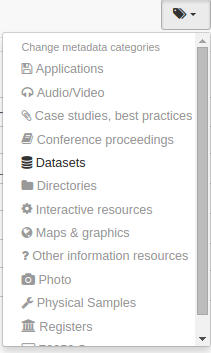

# Классифицирование по категориям

Каталог в GeoNetwork может определить набор категорий, которые можно использовать для классификации записей метаданных для удобства поиска или управления (см. [Управление категориями](../../administrator-guide/managing-classification-systems/managing-categories.md)). Категории добавляются в саму запись метаданных и не могут быть экспортированы при сборе записи (например, при использовании протокола CSW). Если категория должна распространяться вместе с метаданными, используйте другие протоколы сбора (например, GeoNetwork) или используйте ключевые слова (см. [Теги по ключевым словам](tagging-with-keywords.md)).

Существует два способа присвоить категории для записи метаданных:

- Поиск записей, выбор одной или нескольких записей и выбор `Обновить категории` при выборе.
- С помощью **тегов** пользователь может либо заменить категории, либо добавить новые.

- Найдите запись метаданных, откройте редактор и нажмите на кнопку `Категории`. Появится выпадающее меню.
- Используя выпадающее меню изменить категории у записи метаданных, назначьте одну или несколько категорий, установив соответствующие флажки.

