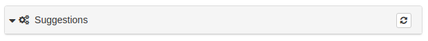
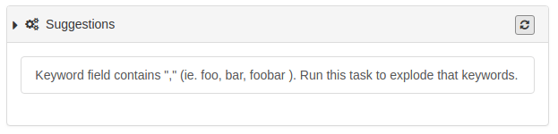

# Подсказки по улучшению метаданных {#metadata_suggestion}

Редактор метаданных можно настроить так, чтобы он анализировал метаданные и делал предложения по их улучшению. В качестве примера можно привести разбиение списка ключевых слов, разделенных запятыми, в одном элементе на несколько отдельных элементов.

Процессы, доступные в данной схеме метаданных, определяются в файле схемы `suggest.xsl`, например <https://github.com/metadata101/iso19139.mcp/blob/master/src/main/plugin/iso19139.mcp/suggest.xsl>.

Файлы xsl для каждого процесса находятся в папке `process` внутри схемы.

Чтобы использовать службу подсказок для метаданных, она должна быть определена хотя бы в одном из представлений макета редактирования схемы.

В режиме редактирования пользователь должен нажать на значок в мастере предложений, чтобы запустить службу подказое для метаданных:

Если в процессе анализа программа не найдёт возможные улучшения метаданных, процесс не даст результатов. Если программа определит места, которые можно улучшить, такие как приведенный выше эксплодер ключевых слов, это будет показано в результатах:

Чтобы запустить xsl и преобразовать метаданные, нужно кликнуть на задачу. При использовании сервиса подсказок для вышеописанного примера, ключевые слова изменятся с такого вида:

на такой:

##  Создание нового процесса

<https://geonetwork-opensource.org/manuals/3.6.x/en/user-guide/workflow/batchupdate-xsl.html?highlight=process#adding-batch-process> for information on how to add a new process. The new process must then be registered in `suggest.xsl`
